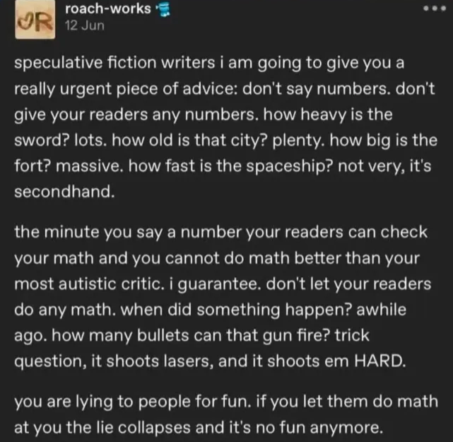

# Iconoplasm FAQ

1. **What is this and who is this for?**

    [Iconoplasm](https://iconoplasm.brinedew.bio/) is a browser extension where each gene on any web page gets its own character portrait. The target audience are life science students and preclinical researchers.

1. **Does anyone actually care about that?**

    Scott Alexander explicitly requested this kind of tool in [his post](https://slatestarcodex.com/2013/08/14/extreme-mnemonics/) on extreme mnemonics.

    > *JS-154 is one of five metabolic products of netamine; however, the enzyme that produces it is unknown. It is manufactured in cells in the far rostral region of of the cerebrum, but after binding with a leukocynoid it takes a role in maintaining the blood-brain barrier – in particular guiding the movements of lipid molecules.*
    >
    > I find I can read paragraphs like this five or six times, write them on flashcards, enter them into Anki, and my brain still refuses to understand or remember them after weeks of trying.
    >
    > On the other hand, ==my brain easily remembers vastly more complicated structures when they’re loaded with human-accessible meaning==. For example, just by casually reading the Game of Thrones series, I know an extremely intricate web of genealogies, alliances, locations, journeys, battlesites, et cetera. Byte for byte, an average Game of Thrones reader/viewer probably has as much Game of Thrones information as a neuroscience Ph.D has molecular biology information, but getting the neuroscience info is still a thousand times harder.
    > ...
    > This makes me wonder if it would be ==possible to produce a story as enjoyable as Game of Thrones which was actually isomorphic to the most important pathways in molecular biology==.

    [Chernoff faces](https://en.wikipedia.org/wiki/Chernoff_face) are a quaint 1973 attempt to visualize multivariate data as algorithmically generated faces. They look a bit too bland to be interesting to memorize. Now, 50 years later and with a massive leap in image generation capability, we can do better.

    [Gijinka](https://knowyourmeme.com/memes/gijinka-moe-anthropomorphism) are memeable humanizations of natural world entities, or even abstract concepts, that have existed on the internet since its invention. There are gijinka of companies, planets, and periodic table elements. The casts of [Cells at Work!](https://en.wikipedia.org/wiki/Cells_at_Work!) and [Osmosis Jones](https://en.wikipedia.org/wiki/Osmosis_Jones) are gijinka of human "cell types", and are fondly remembered by the new generation of biomedical researchers.

1. **Why use AI generation? Why not pay artists?**

    Economics for 20 thousand images.

    I would love to get 20 thousand human-made illustrations. But the price floor for commissioning a basic original character illustration is $10.

    This makes it necessary for me to get a $200k grant just for one image option per gene.

    This doesn't include the cost for tracking down and inviting the artists, or setting up and promoting some kind of reward program for content submission.

    Also it limits us to 1 image per character - if we later decide they don't fit well within their gene family, we would have to spend extra on redraws.

    Plus, selecting $10 artists with no QC makes it basically guaranteed that AI-generated work will still be present on the site, just under a human name.

    That said, a later conversion to a human-made gallery is not out of the question.

1. **One of the images looks like my work. I want that artist tag blocked.**

    You can use the [blocklist form](https://iconoplasm.brinedew.bio/blocklist).

    Enter the exact @name tag as it appears in the tag explorer: <https://thetacursed.github.io/Anima-Style-Explorer/>

    The site will queue the request and the local Iconoplasm workstation will apply it to the site blocklist during Website Ops sync.

    If you don't want to use Discord site login, you can send a blocklist email request to <blacklist@brinedew.bio> from your business account. The first @name you send me will be blocklisted. Make sure to use the @ symbol in front of the name.

1. **I noticed a poor quality of the canonical image for some gene. What do I do?**

    Go to the gene page for that gene. Tap "edit image" under the canonical image, and input small corrections as an image prompt. This adds a corrected image to a candidate images pool.

    Some corrections you can prompt for:

    - Fix nonsensical anatomy (fingers, limbs, props)
    - Improve fit to anchor characteristics (weight, age, surface color)
    - Add a fitting background

1. **It's not easily fixable - I don't like the entire concept or art style of the canonical image.**

    Downvote the canonical image by tapping X under the image. Upvote a better candidate image by pressing the checkmark.

1. **All candidate images are even worse.**

    Tap "new candidate" to make a new candidate image. Make sure you have inputted API keys for your image generation service of choice in the site settings.

1. **All generated images for a gene reuse the same bad character concept.**

    Join our Discord to discuss how to modify character prompts for various gene families.

1. **I noticed a candidate image that would better fit another gene.**

    Open this image fullscreen, then click "copy this image to another gene". Then select the gene from the dropdown menu. This adds it as a new candidate image to that gene, and auto-checkmarks it.

1. **What images are not suitable for Iconoplasm?**

    - 18+ images aren't suitable. No reproductive organs, no nipples.
    - Furries aren't suitable to represent human genes. Keep them for other animal genomes. I'm looking forward to Drosophila characters.
    - Same goes for any non-humanoid objects (for example, object-heads), however helmets are OK.
    - Monstrous humanlike faces (for example, ogres, nekomimi) are OK if they pass more as human than as animal. Monster-human hybrids are OK if the top part is human (centaurs, nagas, driders).

1. **Why did some API routes stop being openly scriptable?**

    Because the rich per-gene routes are the easiest way to turn Iconoplasm into an accidental bulk mirror and run up Cloudflare costs for no scientific benefit.

    Normal use is still supported:

    - the website UI still works
    - the browser extension still works
    - lightweight public metadata and catalog sync routes still work

    If you want to mirror or analyze the data programmatically, use the public bulk-friendly contract instead of one-gene-at-a-time scraping:

    - `/api/public/v1/metadata`
    - `/api/public/v1/catalog/manifest`
    - the immutable catalog artifact and JSONL dump listed in that manifest
    - `/api/public/v1/changes`
    - `/api/public/v1/resolve`

    That is the supported way to keep a local copy up to date. It is cheaper, cacheable, and much less likely to melt the budget just because someone decided to enumerate the whole catalog through the most expensive route possible.

1. **Why aren't you featuring artists names in style descriptions by default?**

    Artists don't want their names under some AI generated content. I'm not so sure I would want my name near some of their content either.

1. **Why aren't you matching a rendering style across all images?**

    Rendering cohesion is good to have for rosters of 100-500 characters, but with 20k designs we need all the sources of variations we can get. It's useful to feature mismatched rendering styles (photographic, historical, anime) that help distinguish characters who look similar on paper.

1. **What's the legal status of the generated images?**

    Who knows! It's 2026 and the status of generative content is murky and varies by jurisdiction. Regardless, my intent is for the images and the character designs to be freely available to anyone to reuse, spread, or profit from.

1. **Why aren't you allowing people to upload custom images from their PC?**

    Several reasons.

    First, third party image-gen services do their own moderation, which saves us some moderation headache.

    Second, it saves us from mass-upload attacks to my site infrastructure.

    Third, it helps to maintain strict chain of provenance over the gallery and uniformly permissive IP policy over all characters - with uploaded images, I don't know if you uploaded someone else's IP.

1. **Is there any kind of narrative or worldbuilding that these characters inhabit?**

    It's up to the users to make up the world that makes sense in the context of their research interest. To a circulatory system researcher, the characters may be living in lotus petals by the river. To a developmental biologist, they may be crew in generational spaceships. To an oncologist, they may be isolated within bubble universes, engaged in multiversal acausal trade.

    However, as a guidance, I can suggest some constraints.

    - The protein-to-cell diameter ratio is roughly around 1:10,000 in humans. Intuitively, it would compare to a 1.5m-tall person living in a large 15 km-wide city - somewhere between Paris and Moscow in size.
    - that said, 
    - It gets unnecessarily complicated if you try to represent each copy of the protein molecule with its own character, so it makes sense to map gene expression strength to character presence. Highly expressed genes are represented by superpowered characters, barely expressed genes are weak.
    - Many diagrams put cytoplasm below the cell membrane, and extracellular space above it. But here, the orientation I find helpful is that being a cell membrane protein feels like being an ice fisher: cell membrane is what you're walking on, extracellular space is below it (down the hole) and the cell nucleus is above you (obscured and unreachable like the winter sun). In that sense, having a transmembrane domain is akin to "being subjected to gravity".
    - RNAs could be thought of as transient ghost-like spirits that can affect the world only in limited ways. Ribosomes would be the shrine where these spirits incarnate into a material shell. The time before ribosomes existed is covered in mystery - perhaps the rumors of the ancient world of songs upon songs.
    - DNA is best represented as immaterial soul storage for the characters: gravestones, phylacteria, vinyl records, scrolls. The only way to get rid of the character for good is to destroy the soul storage - otherwise there's always a risk they'll come back from the dead.
    - In real world, we can see what's far ahead on the horizon. However, in iconoplasm worlds, each character has very limited information about what's happening elsewhere in the cell. For example, the characters can't see a cell membrane being ruptured from far away - this information needs to be spread through messengers, rumor networks, or carried as a vague directional smell. Think of it as a dense mist or blur covering the world.
    - Information about what's outside the cell membrane is even less inaccessible. Most characters can't know for sure if they're a part of some grand design like a multicellular body - only the outer membrane proteins are even directly aware there's other cells below them. The "developmental plan" must have more of a ritual or compelled connotation rather than rational design, and there's doubt and suspicion when characters use grand narratives to justify drastic action.
    - Inspiration: SOLSTICE-5 by Paul Chadeisson https://www.youtube.com/watch?v=cntb3wcZdTw
    - You can tell two stories about a protein participating in two different "runs" (translation->some pathway->degradation, translation->some other pathway->degradation). During each run, the memory is stored as post-translational modifications. However, the memories don't get carried over across runs: each time the protein is translated anew, its memories are blank about what happened "last run".
    - Why are characters wearing a mishmash of historical and fantastical outfits and body parts? Everyone has their pet theory. Perhaps this is afterlife, where souls gather from all possible timelines. Or maybe a pre-life, a divine host tasked with building the next inhabitable universe. Maybe this is an outcome of a botched hivemind merge. Or maybe it's all just a simulation.
    - Cell replication (mitosis) is happening when the majority of the cast is "asleep": only the mysterious skeleton crew, who most never meet, is awake and splitting the cell.
    - What's the motivation to initiate the mitosis? There are factions that are pro-and anti-replication, with their own motivations and narratives. Sometimes, one side wins, sometimes, the other.
    - When the pro-Growth side wins, the cell replicates. Sometimes, the characters benefit (germline, regeneration). Other times, they die (oncogenesis).
    - When the pro-Control side wins, the cell enters quiescence. Sometimes, the characters benefit (morphogenesis). Other times, they die (apoptosis, aging).

1. **Any ideas for scenarios to explore from inside the cell?**
My favourite scenarios are the ones where cell makes a decision to self-sacrifice or hamper itself in some way for some vague and unseen "common good".
* Enucleation of an erythrocyte.
* Oncogene-induced apoptosis.
* Living next to a SASP senescent cell
* Cell is in a body that just died of heart attack. 
* Sperm-egg fusion.
* Leukocyte migration.
* Lineage potency restriction in early development.
* Being assigned a transit amplifying role.
* Immortalisation as a Hela cell

![[image-24.png]]

1. **How can we support the project?**

    Please participate! Vote on some images, generate and edit the picks, write lore pages. Join the Discord to discuss ideas for character concepts. Share the link with people who have relevant knowledge or strong visual taste. Donate using the link on [[Support Me]] page.
