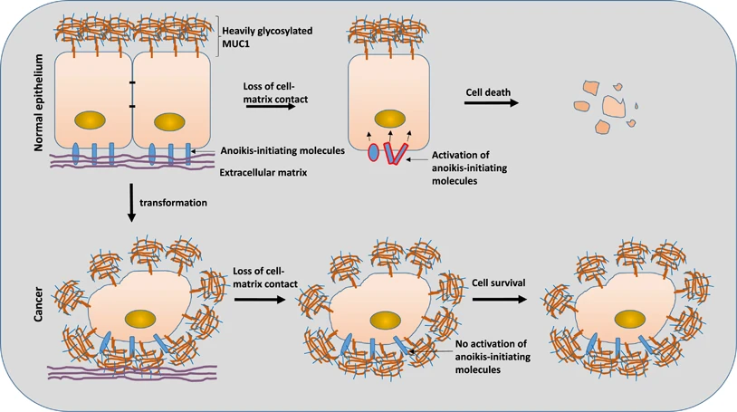

<!-- lineage:scaffold start -->

## Cell lines can be immortal. Why aren't bodies?

### [Hook with striking examples] How can individual cells be immortal?

### [Establish contrast with multicellular mortality] Why do multicellular organisms age and die?

### [Pose the core evolutionary puzzle] Why do multicellular organisms suppress cellular immortality?

### [Pose provocative question that hits reader in gut] Are immortalized cells always parasitic?

### [Challenge reader's assumptions about evolutionary design] Why design easily accessible dormant immortality?

### [Set up the central thesis question] What makes cellular immortality incompatible with cooperation?

## Peto's paradox: cancer incidence vs body size
Larger species evolved stronger anti‑cancer surveillance despite more cells.

### [Establish mathematical prediction] Why should big animals be impossible?

### [Reveal the paradoxical reality] But big animals have LESS cancer

### [Provide concrete mechanisms] How do big animals cheat the math?

### [Hint at the trade-off theme] Enhanced control comes at a cost

## Evolved to stop evolving
Cancer replays unicellular competition; multicellularity suppresses it.

### [List cancer cell behaviors to set up reveal] What do cancer cells actually do?

### [Deliver the reframe/punchline] Sorry, did I say "cancer cells"?

### [Explain the deeper insight] Multicellularity as imposed truce

## The coordination framework
Principal–agent framing: de‑Darwinize cells to coordinate the body.

### [Establish the coordination insight] Life as a coordination problem

### [Introduce de-Darwinization concept] Evolution suppressing evolution

### [Frame as economic problem] The organism's management challenge

### [Present research evidence] Cancer as evolutionary reversion

### [Explain the mathematical threat] Why the organism is losing the war

### [Set up the defense framework] Why layered defenses are necessary

## Layer 0: An ounce of prevention

Reduce mutation rate; buy limited replication credits for tissues.

### [Establish the core problem] Why cell division is like counterfeiting

### [Present evolution's solution] Building quality control systems

### [Introduce budget metaphor] The replication credit system

### [Explore the trade-off] High-regeneration animals pay the price

## Layer 1: Cellular class system
Divide labor: protected stem factories make disposable worker cells.

### [Establish governance necessity] Why quality control isn't enough

### [Explain the Weismann barrier] Separating workers from reproducers

### [Describe bottleneck purging] Starting fresh each generation

### [Present self-recognition systems] Keeping outsiders out

### [Explain specialized cell creation] Building different cell types

### [Detail molecular enforcement] How Volvox keeps workers working

### [Present the central trade-off] Specialization costs regeneration

## The regeneration problem
Regeneration trades off with safety; brains/hearts are non‑renewable.

### [Present the fundamental dilemma] The cancer-regeneration trade-off

### [Reframe the solution] Bodies as production systems

### [Give concrete example] The gut as conveyor belt

### [Explain how it solves cancer] Why factories work against cancer

### [But reveal the cost] When the factory breaks down

### [Define the commitment process] What differentiation really means

### [Present high-risk alternative] Some animals gamble with stem cells

### [Introduce extreme strategy] Brain and heart go full terminal

### [Explain the evolutionary logic] Size forces harsh choices

### [Deliver the sobering conclusion] Non-renewable critical organs

### [Show size-regeneration scaling] Why bigger means more fragile

## Layer 2: Complete Governance Architecture
Local and systemic governance: from neighbors to hormones.

### [Set up the governance challenge] Trillions of potential rogues

### [Explain local consensus system] Two-key nuclear launch

### [Detail crowding mechanism] Molecular handshakes that say "stop"

### [Present attachment dependency] Stay attached or die

### [Describe stem cell leashing] Geographic licenses for division

### [Explain regional broadcasts] Chemical stop signals

### [Detail developmental patterning] Chemical fences and physical tension

### [Reveal the regeneration cost] Perfect formation, no regeneration

### [Present systemic override] Hormonal override authority
Stress and GH/IGF‑1 impose system‑wide vetoes on division.

## Layer 3: Elimination Mechanisms - how to kill a cell
Escalation tier: intrinsic, extrinsic, and immune elimination.
## Layer 3A: Avoiding Suicide (Intrinsic Apoptosis)
Intrinsic apoptosis: detect internal faults; repair, senesce, or die.

Cells that detect internal problems can self-destruct through their own decision-making machinery. Cancer cells must systematically disable these internal quality control systems.

Three elimination modes overview and rationale.

### [Establish the detection problem] How cells patrol their own DNA

### [Explain the p53 system] Three buttons: repair, retire, or die

### [Show how cancer breaks it] Disabling the safety system

### [Present the trade-off] Overly cautious = gradual decline

### [Introduce division limits] The cellular punch card system

### [Explain the senescence trade-off] Punch cards expire, tissues decline

### [Explain metabolic monitoring] Fair-weather division policies

### [Present cytosolic DNA alarms] DNA in the wrong place

### [Describe dsRNA detection] Ancient antiviral defenses repurposed

### [Detail ribosomal quality control] Factory floor management

## Layer 3B: Avoiding Assisted Suicide (Death Receptor Pathways)
Extrinsic apoptosis: resist death‑receptor and senescence cues.

External forces can convince cells to trigger their own death machinery. Cancer cells must learn to ignore these assisted suicide signals while maintaining enough normal cellular behavior to avoid triggering direct elimination.

### [Present polite assassination] Death-receptor roulette
Fas/TRAIL trigger caspases; collateral risk to normal cells.

### [Explain house arrest system] Senescent cells call the cops on themselves
SASP broadcasts summon clearance; chronic signaling harms tissue.

### [Describe social pressure to die] Cooperative suicide for the team
Cytokines request cooperative suicide of bystanders.

### [Show dependency system] No growth factors, no survival
Survival depends on growth factors; tumors go autarkic.

### [Present fitness-based elimination] Survival of the fittest neighbors
Fitter cells cull neighbors; tumors win or ignore cues.

## Layer 3C: Avoiding Murder (Immune Elimination)
Immune murder: evade CTLs, NKs, macrophages, complement.

When intrinsic and extrinsic apoptosis fail, immune surveillance systems actively eliminate aberrant cells.

### [Explain cellular ID system] Papers, please: showing your protein ID
MHC‑I peptidome exposes state to CTLs; tumors hide.

### [Present guilty-until-proven-innocent system] NK cells: silence equals guilt
NKs kill MHC‑I‑low cells via default‑kill logic.

### [Describe stress detection] Cells that scream for help
NKG2D ligands flag stressed cells for removal.

### IV. Macrophage Street Cleaning

### V. Complement System

### VI. Nutrient Starvation

### VII. Physical Containment

## Layer 4: When the defenses escalate
With age, defenses intensify; anti‑cancer escalation drives decline.

### [Set up the aging paradox] Defenses should decay, but they intensify

### [Present counter-evidence] Anti-cancer systems get stronger with age

### [Pose the key question] Why maintain systems that harm the organism?

## Applications and Implications
Predictions, interventions, and philosophical consequences.

### [Present the dangerous implications] Why anti-aging could be pro-cancer

### [Present testable predictions] What the model predicts will fail

### [Reframe biological understanding] What this means for biology

## Appendix: Historical Evidence for Cellular Control Mechanisms
Historical milestones evidencing cellular control and tumor suppression.

### [Present supporting evidence] Historical milestones in cellular control

<!-- lineage:scaffold end -->

<!-- lineage:content start -->

# The Price Of Not Being Cancer

Multicellular organisms are not immortal. The cells that make up a dog's body age and die within decades while the CTVT lineage thrives for millennia.

If cellular immortality is achievable and evolutionarily successful at the cellular level, why do multicellular organisms suppress it?

Is it always true that immortalized cells become parasitic? Are there no benign immortal cell lines in an organism?

If evolution doesn't care enough to make bodies immortal, why did it bother to design body subunits to have easily accessible immortality that stays dormant?

Let's try to find satisfying answers beyond just "cancer cells are just broken and shouldn't be compared to healthy cells" and see if we can figure out what is it about cellular immortality that makes it hard to make these cells stick together.

(And yes, fair warning: I'm about to anthropomorphize evolution more than a Pixar movie. If that bothers you, mentally replace every "evolution decided" with "selective pressures resulted in." We both know what's really happening.)

Every time a cell divides, DNA replication introduces random errors. Most are harmless, but occasionally you get a mutation that gives a cell a growth advantage - faster division, resistance to suicide commands, ability to grow without external permission signals. That cell outcompetes its neighbors and expands into a clone. Within that larger clone, more mutations occur, some of which provide additional advantages. After accumulating several key mutations, you get cancer.

The mathematics are unforgiving. If mutation rate per division is fixed, then more cells dividing for longer periods should equal vastly higher cancer risk. Compare species: mice (~10^9 cells, 2 years), humans (~10^13 cells, 80 years), blue whales (~10^17 cells, 80-90 years).

By naive scaling, whale cancer risk should be astronomical compared to mice. Whales should be evolutionarily impossible - they'd die of cancer before reproducing.

But they're not extinct. Mice get cancer at ~40% lifetime rates. Humans get cancer at ~20% lifetime rates. Elephants get cancer at ~5% lifetime rates despite having vastly more cells living much longer.

This pattern - larger animals having lower cancer rates despite more cells - shows that larger species evolved enhanced anti-cancer mechanisms that scale with body size. Within each species, older/larger individuals still get more cancer as expected. But between species, the scaling relationship breaks down because evolution upgraded the surveillance systems.

Concrete examples make this vivid: elephants carry ~20 copies of the tumor suppressor gene TP53 (we have ~1), and their cells trigger apoptosis at much higher rates after DNA damage — a zero‑tolerance policy for sketchy genomes. Bowhead whales (200+ year lifespans) show signatures of selection in DNA repair and cell‑cycle control genes; comparative genomics points to reinforced maintenance rather than magical cancer resistance.

This observation shows that more stringent cellular control is possible, but implies it comes at increasing cost.

Let's talk about what cancer cells actually do:

- Multiply blazingly fast
- Don't die when told
- Hog resources
- Bully nearby cells
- Evolve to get better at all the above

Sorry, did I say "cancer cells"? My bad, "single cells". It's what living unicellular organisms do, and did ever since the Late Heavy Bombardment.

For billions of years, this was life: unicellular organisms compete; mutations fuel adaptation; lineages rise and fall. That's the baseline. Multicellularity is a hard‑won, highly regulated truce imposed on that Malthusian free‑for‑all. When a cell "becomes cancerous," it systematically dismantles that truce and reverts to the ancient playbook of unicellular competition.

This pattern points to a deeper principle: multicellular life is fundamentally a coordination problem between competing agents.

For four billion years, cellular success meant rapid replication, resource consumption, resistance to death, invasion of new territories, and evolution to get better at all of the above. Cancer cells exhibit this exact repertoire - the only difference is they're doing it inside a multicellular body instead of a primordial soup.

Every cell in your body retains the genetic machinery for unlimited replication and competitive behavior. These capabilities aren't aberrations - they're the evolutionary baseline that must be actively suppressed.

Philosopher Peter Godfrey‑Smith calls this de‑Darwinization: lower‑level units (cells) lose their Darwinian autonomy when they become parts of a higher‑level individual. In organisms, cell fitness is subordinated to organismal fitness; evolution literally builds mechanisms that suppress selection within you.

This creates what economists call a **Principal-Agent Problem**: the organism (principal) must control trillions of cells (agents) that are constantly mutating back toward their ancestral competitive behavior. Each somatic mutation is a potential step toward cellular defection. The organism must detect and eliminate these defectors while maintaining the cellular functions it needs to survive.

Gerstung et al. (2020) analyzed 2,658 cancers and found that early oncogenesis involves mutations in a constrained set of driver genes, while later cancer progression shows a fourfold diversification of driver genes and increased genomic instability.

Lineweaver and colleagues claim there's a deeper pattern here. Their "serial atavism model" proposes that cancer is cells reverting through evolutionary history in reverse chronological order. The idea is that recently evolved genes controlling multicellular cooperation get corrupted first because they're less essential for cellular survival, while ancient metabolic genes stay intact longer because cells die without them. If true, this would mean cancers systematically reactivate ancient single-cell programs rather than just malfunctioning randomly. But this is still speculative - we don't know if the correlation between gene age and mutation timing holds across cancer types, or whether there are alternative explanations for the patterns they observe.

Large animals apparently solve this Principal-Agent problem - but only through surveillance systems that eliminate more cells through apoptosis and senescence.

The threat mechanism is straightforward: trillions of cells dividing over decades create enormous opportunities for beneficial mutations. Even with low per-division mutation rates, the sheer volume guarantees that advantageous mutations will occur. Some mutations confer local selective advantages - faster division, resistance to suicide commands, ability to grow without permission. A cell with even small growth advantages will exponentially outcompete neighbors, expanding into a population of identical mutant descendants. These larger mutant populations provide bigger targets for subsequent cancer-causing mutations. Cancer typically requires 3-7 key mutations, and bigger populations of defector cells accumulate these faster.

This internal evolutionary pressure necessitates layered defenses. Each layer counters specific cellular "cheating strategies" that arise as cells attempt to revert to their ancestral competitive behavior.

Consider the fundamental problem first: every time a cell divides, DNA replication introduces errors. Think of it as biological counterfeiting - most mistakes are harmless, but occasionally you get a mutation that gives a cell a selective advantage over its neighbors. If the error rate is too high, you're basically handing out lottery tickets for cellular rebellion.

Evolution's response was to build incredibly sophisticated quality control systems. Multiple layers of proofreading during DNA replication, plus repair mechanisms that can fix different types of damage after the fact. These systems dramatically reduce the effective mutation rate - instead of getting dangerous mutations every few hundred cell divisions, you might get them every few thousand or tens of thousands.

This creates what we can think of as a "replication credit budget." Higher fidelity DNA maintenance means you can afford more total cell divisions before cancer becomes likely. It's like having better quality control in manufacturing - fewer defective products means you can run longer production cycles before hitting unacceptable failure rates.

Organisms with extreme regenerative abilities - think flatworms that can regrow from tiny fragments - need exceptionally high-fidelity DNA repair in their stem cells. They're constantly making new tissue, so they need very low mutation rates to avoid accumulating too many cellular defects. The trade-off is that these sophisticated repair systems are metabolically expensive, and they're still not perfect.

Quality control isn't enough. You need governance structure that prevents somatic evolution from becoming heritable.

**Weismann barrier:** Germline cells reproduce and pass genes to offspring. Somatic cells work, age, and die without genetic descendants. If any body cell could contribute to the next generation, every beneficial mutation for cellular selfishness would spread through the population. The organism would degrade into competing cellular lineages.

Plants violate this completely. They do somatic embryogenesis - growing new individuals from any adult tissue. You can clone an entire plant from a leaf. Their somatic mutations routinely become heritable.

**Single-cell bottleneck:** Each generation starts from one fertilized egg, purging accumulated somatic variation. Harmful mutations present in that starting cell kill the embryo through developmental selection.

This also fails in plants. Vegetative reproduction through runners, bulbs, or grafting bypasses the bottleneck entirely. You can graft tomatoes onto potato roots because both recognize each other as compatible tissue.

**Allorecognition:** The ability to distinguish self from non-self tissue. Prevents unrelated cells from infiltrating the organism and prevents fusion with genetically dissimilar individuals.

Slime molds like Physarum can fuse with genetically compatible individuals, creating multinucleate networks. Even plants can graft to close relatives within the same family.

**Asymmetric division:** Cells create specialized daughters with different fates through unequal distribution of cellular components. This generates cellular diversity without requiring external signals.

**Enforcement mechanisms:** These systems require active molecular maintenance. Volvox demonstrates how this works mechanistically. Reproductive cells can accidentally execute ancestral behavioral programs - becoming motile when they should reproduce. This isn't strategic, it's developmental confusion where cells run obsolete programs inappropriate for multicellular life.

Two molecular locks prevent this. Lag suppresses ancestral sequential programs in reproductive cells, ensuring they skip the motile phase. RegA actively suppresses reproduction in worker cells. RegA is a transcriptional repressor containing a SAND domain that selectively silences genes for growth and reproduction, particularly chloroplast biogenesis. When RegA fails, worker cells transform into reproductive cells, creating dense colonies that can't swim because everyone reproduces and nobody works.

Both systems repurpose existing transcriptional control. RegA evolved from a resource-responsive gene that originally regulated growth based on environmental conditions. Evolution repurposed it from temporal control ("don't reproduce when resources are scarce") to spatial control ("don't reproduce if you're a worker cell, ever"). Same molecular machinery, different coordination problem.

The cost: specialized cells have limited growth potential. Good for preventing defection, bad for regeneration. Bodies made of non-dividing cells can't repair damage by making new cells. To evolve regeneration, you need controlled cellular defection for repair while preventing uncontrolled defection that kills the organism.

The cellular class system creates a dilemma: if you want to prevent cancer, you make cells that can't divide and reproduce. But if you can't make new cells, you can't repair damage or regrow lost body parts.

To understand how bodies solve this, you need to completely reframe how tissues work. Most people imagine bodies as just cells scattered around randomly like components in a computer. That's wrong. Bodies are organized as **production systems** where small populations of protected stem cells continuously manufacture streams of disposable working cells.

Take your gut lining. At the bottom of microscopic pits, a few stem cells divide constantly, pushing their daughter cells upward in a conveyor belt. As cells move up, they specialize into different jobs - absorbing nutrients, secreting mucus, detecting toxins. After 3-5 days of work, they reach the top and are intentionally killed off and replaced by the next batch moving up from below.

This is the standard body plan: permanent stem cell factories producing disposable workers. The gut lining replaces itself completely every few days. Skin does this every few weeks. Blood cells are manufactured in bone marrow and most live only days to months before dying and being replaced.

This production system architecture solves the cancer problem elegantly. The workers can't cause cancer because they're designed to die quickly and can't divide. The stem cells that do divide are kept in small numbers in protected niches with intense surveillance.

But it creates a regeneration crisis. If you damage the stem cell factory itself, you can't make new workers. Destroy the stem cells at the base of hair follicles and you go permanently bald. Damage bone marrow stem cells with chemotherapy and you can't make new blood cells.

The process of cells committing to specific worker roles is called **differentiation**. Cells turn on specialized gene programs and turn off their general-purpose capabilities. **Terminal differentiation** means the commitment is permanent - the cell can never go back to being a stem cell or change jobs.

Some animals take enormous risks to avoid this problem. Planarians keep roughly 20% of their body mass as stem cells - undifferentiated cells that retain the ability to become anything. You can cut them into pieces and each piece regrows because stem cells are everywhere. But this is incredibly dangerous from a cancer prevention standpoint. Every stem cell is a potential tumor.

Most animals, including humans, compromise. They organize as production systems with small, heavily controlled stem cell populations and accept that complex regeneration is impossible. The liver is a rare exception - liver cells can be reactivated to divide when needed, which is why livers regenerate well but also why they're cancer-prone.

But what about organs like the brain and heart? These follow a completely different strategy: make nearly all cells terminally differentiated and maintain almost no stem cells at all.

The evolutionary logic is clear. The larger an animal gets, the more cancer risk it faces from every dividing cell. So large animals minimize the number of stem cells to only those absolutely necessary for survival. Your gut lining gets worn away by food and stomach acid daily - it needs constant replacement, so you maintain gut stem cells despite the cancer risk. Your blood cells are exposed to toxins and pathogens and wear out quickly - you need bone marrow stem cells.

But your brain neurons and heart muscle cells can potentially last your entire lifetime if nothing damages them. They don't get scraped off or worn out through normal function. So the evolutionary calculation is: why maintain dangerous stem cells for organs that don't need constant replacement?

The result is that brain and heart are essentially non-renewable resources. Damage them and they stay damaged. Most neurons you're born with are the only ones you'll ever have. Heart attacks kill heart muscle permanently because the cardiomyocytes lost their ability to divide early in development.

This is why larger animals are increasingly fragile. Newborn mice can completely regenerate heart tissue for about one week after birth through existing cardiomyocytes dividing to replace damaged tissue. But by day 7, those same heart muscle cells become permanently unable to divide - they become binucleated and terminally differentiated. Adult mice, like humans, repair heart damage with scar tissue formation, a patch job that doesn't restore function. Humans skip the regenerative phase entirely - even newborn humans can't regenerate heart tissue like newborn mice can.

The trade-off becomes starker as you scale up: elephants and whales achieve cancer resistance partly by making even more of their tissues non-regenerative than humans do.

Even with cellular class systems and quality control, you still have trillions of cells that could potentially go rogue. Layer 2 manages cellular agents across different scales, from immediate neighbors to entire organ systems.

**Local control:** Cell division requires consensus from surrounding tissue. A cell needs persistent growth signals from neighbors plus completion of internal checkpoints - a two-key nuclear launch system. Cancer typically hotwires this by forging growth signals or bypassing checkpoints.

Contact inhibition works through physical crowding sensors built into cell membranes. When cells grow until they're touching their neighbors on all sides, membrane proteins called cadherins link up between adjacent cells like molecular handshakes. These handshake connections trigger biochemical cascades inside the cell that shut down the proteins needed for DNA replication.

The physical mechanism is straightforward: crowded cells literally can't expand further because they're mechanically constrained by their neighbors. The cadherin linkages translate this physical constraint into chemical signals that tell the cell's division machinery "stop trying to divide - there's no room to grow into."

This fails in cancer because tumor cells often lose their cadherin proteins or ignore the "stop" signals from crowding. They start dividing anyway, piling up on top of each other in disorganized masses instead of forming the neat, organized tissue layers that contact inhibition normally creates.

**Anchorage dependence:** In many tissues, "stay attached or die" is a great anti-defector policy. Epithelial cells expect a "stay alive" integrin signal from the surrounding matrix; when that confirmation disappears, cells are primed to execute an suicide-on-detachment internal program (anoikis) that kills the detached cell. This policy reduces the risk of cells surviving in the wrong place, at the cost of slower remodeling regeneration (can't send extra cells to where they're needed).

Source: https://www.nature.com/articles/cddis2017363

**Stem cell geographic leashing:** Stem cells can only survive and divide within their specialized niche microenvironments, which provide unique survival signals like Wnt. If stem cells leave their niche, they lose proliferation licenses. This limits repair range and speed but prevents stem cell escape.

**Regional chemical broadcasts:** The organism uses diffusible "stop" signals (cytostatics like TGF-β) across tissue regions. Cells with appropriate receptors halt division when they detect these signals. This allows coordinated control of tissue architecture but can suppress necessary regeneration.

**Developmental patterning:** Organs are sculpted through chemical gradients of morphogens (Shh, BMP) that define "proliferation zones." Cells outside these zones shut down replication. The Hippo-YAP pathway provides mechanical feedback - when organs become tightly packed, physical tension signals growth termination.

This rigid developmental programming makes it extremely difficult to regrow complex organs after injury. The "stop" signals are powerful and often permanent. The price for perfectly formed organs is near-total inability to regenerate them. Cancer must ignore both chemical fences and physical "stop" signals from tissue tension.

### I. Hormonal Override Authority
How does the organism's overall state (famine, systemic stress) influence individual cell behavior? Local conditions might be good for division, but the organism as a whole might need to conserve resources.

The body has system-wide hormonal governance that can issue central "vetoes," overriding local permissions to divide. Stress hormones (glucocorticoids) can command a system-wide halt to non-essential cell division, particularly in the immune system. The Growth Hormone/IGF-1 axis acts as a master regulator, linking the organism's global energy status to cellular proliferation; during calorie restriction, this axis is down-regulated, putting a brake on growth across the body. It's a central command system that synchronizes trillions of agents with the state of the whole.

Chronic stress or malnutrition can suppress the immune system and halt tissue repair, even when needed. The organism's global state takes precedence over local needs, which can be detrimental in the long run. Cancer cells often develop mutations that make them deaf to these system-wide "stop" orders, allowing them to proliferate during times of systemic stress when other cells are dormant.

With multiple layers of governance in place, how does any cell ever achieve uncontrolled proliferation? The answer is that evolution never stops testing these systems.

When the governance systems fail and defectors emerge, the organism needs elimination mechanisms. These operate through three distinct approaches that mirror the governance architecture: **intrinsic suicide** (cell detects internal problems), **assisted suicide** (external signals convince cell to die), and **murder** (external forces directly eliminate the cell).

The cell's genetic blueprint is constantly being damaged by radiation, chemical mutagens, and replication errors. Replicating damaged DNA passes potentially cancerous mutations to descendants.

The cell operates a strict "fix first, then replicate" policy. The p53 system works like a quality control checkpoint with three possible outcomes. When DNA gets damaged - say, by radiation or chemical exposure - the breaks in the DNA strands activate sensor proteins called ATM and ATR. These sensors are basically molecular damage detectors that patrol the DNA constantly.

When ATM or ATR find a break, they chemically modify p53 protein, changing its shape so it can bind to specific DNA sequences that control cell fate. Once activated, p53 acts like a molecular decision-maker with access to three buttons: "pause and repair," "retire permanently," or "commit suicide."

The pause button halts cell division and activates DNA repair systems. If repair succeeds within a few hours, p53 gets turned off and the cell resumes normal function. If repair fails, p53 pushes either the retirement button (the cell stops dividing forever but stays alive) or the suicide button (the cell destroys itself completely).

Cancer cells typically break this system by mutating p53 so it can't bind to DNA anymore, or by overproducing proteins that keep p53 turned off even when there's DNA damage. Without working p53, damaged cells divide anyway, passing their broken DNA to daughter cells.

This process is slow and overly cautious. Minor, repairable damage might trigger permanent retirement or death, leading to gradual loss of functional cells. The organism prefers killing a potentially salvageable cell over risking a saboteur. Cancer cells systematically disable these quality control systems.

How do you enforce a hard limit on total cell divisions? Most somatic cells carry a non-renewable "punch card" with finite divisions (around 50 for human cells). This punch card is a physical structure called a telomere that shortens with each division. When critically short, the exposed chromosome end triggers p53-mediated permanent division halt.

This finite limit drives replicative senescence. Tissues eventually lose repair capacity as cellular punch cards expire. We trade regenerative capacity for cancer suppression. Cancer cells reactivate telomerase to counterfeit new punch cards.

Cells monitor internal conditions before dividing. The enzyme AMPK checks energy reserves (ATP), while stress pathways (p38-MAPK) monitor oxidative damage (ROS). If energy is too low or pollution too high, division halts to prevent creating compromised daughter cells.

This creates "fair-weather" division policies. During metabolic stress (common in aging), even necessary replacement is halted. The organism prioritizes preventing defective cells over maintaining tissue in suboptimal conditions.

DNA belongs in the nucleus. DNA in the cytoplasm signals viral invasion or catastrophic genomic failure (chromothripsis). The cGAS-STING pathway detects cytosolic DNA, producing cGAMP that activates STING. This triggers massive interferon production and intrinsic apoptosis.

The cost is autoimmune interferonopathies—constant antiviral panic. Cancers often delete STING to conduct genomic chaos in peace.

A cell's transcriptional machinery is normally a tightly controlled affair. In cancer, it often descends into chaos, producing aberrant double-stranded RNA (dsRNA)—a molecular pattern usually pathognomonic of a viral infection. The cell repurposes its ancient antiviral defenses to deal with this internal threat. RIG-I-like receptors (RLRs) and Protein Kinase R (PKR) are tripwires designed to detect dsRNA. When triggered, they assume the worst and act decisively, shutting down all protein synthesis to halt the "infection" and initiating apoptosis or another blast of interferon. This interferon signature attracts CTLs to the affected cell. The flaw in this otherwise clever system is its imperfect specificity. The genome is littered with ancient, dormant retroelements that can occasionally be transcribed into dsRNA. This means the tripwire can be tripped by the cell's own legitimate, if somewhat archaic, transcripts—false positive activation from the cell's own transcripts.

The cell's protein factories can stall on defective mRNA templates, creating toxic traffic jams and spitting out useless, misfolded protein fragments. This is a crisis in the cellular supply chain. A system called Ribosome Quality Control (RQC) acts as the floor manager, finding stalled ribosomes and tagging their nascent polypeptide chains with ubiquitin for immediate destruction. But if the RQC is working overtime, it's a sign of a deeper systemic failure. Excessive RQC activity trips a secondary alarm, activating p53 and the NLRP1 inflammasome, which effectively marks the entire factory for demolition via pyroptosis. The price for this vigilance is a reduced tolerance for stress. A hyper-sensitive RQC, while excellent at maintaining purity, can make a cell brittle, throttling protein production in harsh environments where a "good enough" approach might be the only way to survive.

Some cells resist direct killing by perforin and granzymes. For these targets, immune cells use death receptor ligands like FasL and TRAIL to trigger the target cell's own apoptosis machinery. When they encounter a target cell bearing the corresponding receptors—Fas (CD95) or DR4/5—they hand over the pill, but the target cell has to swallow it itself. This triggers the target cell's own extrinsic apoptosis machinery, a clean act of cellular suicide initiated by an external signal but executed by the cell's internal caspase cascades. The target cell executes its own death program rather than being directly killed. The price of this elegant solution is that the "suicide receptors" are not exclusive to criminals. For brief, terrifying moments, they also appear on wound-edge keratinocytes and activated lymphocytes—cells that might dutifully kill themselves when presented with the death signal. This is a feature, not a bug: a brutal but necessary mechanism of self-thinning to prevent the system's own agents from running amok.

What to do with a cell too damaged to divide, yet not quite dead? A cell that might still be holding tissue together but represents a systemic risk? The state's answer is a form of house arrest: senescence. Driven by tumor suppressors like p53 or p16^INK4A, the cell's cycle is permanently locked. But it doesn't just sit there quietly. It is forced to "call the cops on itself" by secreting a pro-inflammatory cocktail of cytokines and chemokines (IL-6, IL-8, CCL2) known as the Senescence-Associated Secretory Phenotype, or SASP. This alarm summons NK cells and macrophages to the scene for a final, clean removal. A few such calls are a sign of a healthy, self-policing tissue. The price is paid when the calls become chronic. Widespread senescence during aging turns entire tissues into smouldering cytokine swamps, driving fibrosis, cachexia, and a system-wide decline. The alarm system itself becomes the source of the decay.

Sometimes the immune system needs to eliminate cells that are perfectly healthy but in the wrong place at the wrong time - like during an immune response where you need to clear out bystander cells to make room for action. The solution is cytokine-mediated assisted suicide. Immune cells release signals like TNF-α that bind to death receptors and politely ask target cells to die for the greater good. Unlike direct assassination, this gives the target cell a chance to tidy up its affairs first - packaging its DNA neatly, avoiding inflammatory spillage, dying like a gentleman. The target cell can theoretically refuse, but the social pressure is enormous. The problem is that this "die for the team" signal doesn't distinguish between cells that should die and cells that just happen to be in a bad neighborhood. Cancer cells exploit this by becoming deaf to these social death cues while healthy bystander cells dutifully commit suicide around them.

Most cells require constant growth factor signals to survive. Without these signals, they undergo apoptosis. This creates a quality control system where only cells in their proper tissue locations receive the necessary survival signals. Cells that migrate to inappropriate locations lose access to these factors and die. Cancer cells must learn to synthesize their own growth factors or become independent of external supply, essentially learning to live off-grid while everyone else remains dependent on the centralized life support system.

When cells with different fitness levels are neighbors, the fitter cells don't just outcompete the weaker ones - they actively eliminate them through elimination through cell competition. Less fit cells receive molecular signals from their fitter neighbors that trigger apoptosis. This system prevents tissues from being clogged with suboptimal cells, but it also means that cancer cells need to either become the local winners (through mutations that make them more fit) or learn to ignore the social death signals that tell them they're losers.

Every cell continuously samples its own protein production through a built-in monitoring system. Inside each cell, a protein complex called the proteasome randomly cuts up small amounts of every protein being made, creating short fragments 8-11 amino acids long. These fragments get loaded onto transport proteins called MHC-I molecules, which carry them to the cell surface.

This creates a constantly updated display of what's happening inside the cell. T cells have receptors that scan these displayed fragments like reading a ticker tape of cellular activity. If a T cell recognizes a fragment that shouldn't be there - like a piece of viral protein or a mutated cancer protein - it interprets this as evidence of infection or malignancy.

The recognition triggers T cell activation and targeted killing of the displaying cell. The system works because healthy cells only display fragments from normal, expected proteins, while infected or cancerous cells display abnormal fragments that reveal their compromised state.

Cancer cells often escape this surveillance by breaking their MHC-I transport system, so they stop displaying their internal protein fragments altogether. This makes them invisible to T cells, but it also triggers a different immune response from NK cells that specifically target cells with missing MHC-I displays.

Cells can escape this surveillance by stopping their protein display. Cells can down-regulate their MHC-I expression to avoid T cell recognition. This triggers Natural Killer (NK) cell responses, which detect the absence of MHC-I molecules rather than their contents. Their logic is brutally simple: cells that don't display MHC-I are targeted for elimination. The MHC-I molecule itself is the safety signal; its presence actively inhibits the NK cell's default "kill everything" instinct. Take away the flagpole, and the inhibition is lost. The NK cell, interpreting silence as guilt, executes the cell—either by direct injection of cytotoxic granules or by presenting death signals that force the target to commit suicide. No trial, no appeal. This "guilty until proven innocent" system creates both strength and weakness. Some of the most important cells in the body, like neurons, are naturally quiet reporters and barely express any MHC-I. They survive because they express other inhibitory signals that prevent NK cell activation.

But these two systems only handle cells that are either actively broadcasting treason or are suspiciously silent. What about a cell that's just starting to crack under the pressure? It's still flying the flag, but it's also started screaming. A cell undergoing DNA damage or oncogenic stress begins to stud its surface with molecular distress beacons called NKG2D ligands (things like MICA/B and ULBPs). These stress signals are recognized by NK cells and γδ T-cells, which eliminate the stressed cell. The alarm can be triggered by things other than cancer. A bad case of heat shock or a nearby viral infection can make a perfectly healthy cell hit the panic button, triggering elimination by immune cells. It's the price you pay for a system that prefers a little collateral damage over letting a single traitor escape.

Eat‑me/don’t‑eat‑me signals govern phagocytosis.

A functional trillion-celled society cannot be clogged with the corpses of its citizens. Macrophages distinguish between healthy and dying cells through surface markers. Healthy cells express CD47 ("don't eat me" signal) while dying cells expose phosphatidylserine and other "eat me" signals. Macrophages engulf cells that display the wrong marker ratio. This system can be gamed. Tumor cells often overexpress CD47, effectively cloaking themselves from the cleaners. While anti-CD47 therapies can unmask these impostors, they risk a dangerous side effect: the body's own young erythrocytes use the same shield, and stripping it away can lead to a wave of self-inflicted anemia as the newly empowered macrophages get a bit too enthusiastic.

C3b/MAC opsonize and lyse targets; antibody aid.

The complement system provides another elimination mechanism through blood-borne protein cascades. The component C3b can stick directly to abnormal cell membranes, "opsonizing" them as a target. This either flags the cell for phagocytosis or initiates assembly of the Membrane Attack Complex (MAC), which creates pores in the cell membrane causing lysis. Tumor-specific antibodies can enhance this system by linking innate and adaptive responses. In tissues with high complement activity, this can cause collateral damage to nearby healthy cells, leading to inflammation.

Resource denial starves clones; also impairs CTLs.

Rapidly dividing cancer cells are greedy, hogging local amino acids to fuel their expansion. The body can turn this greed into a weapon. Myeloid cells adjacent to a tumor can be induced to express enzymes like IDO1, which depletes tryptophan, or ARG1, which depletes arginine. This creates a nutritional desert, starving the proliferative clones into submission. It's a clever scorched-earth tactic, but it's a booby-trap with a fatal design flaw. The very same nutrient depletion that hobbles tumors also paralyzes the anti-tumor CTLs that require those same amino acids to function. Cancers have ruthlessly exploited this, learning to actively promote this starvation field as a defensive shield, turning a state-designed weapon into their own private fortress.

Physical barriers constrain spread when eradication fails.

When all else fails—when eradication is off the table—the final strategy is containment. If you can't kill the rogue state, you wall it off. Activated fibroblasts are summoned to the lesion, where they lay down a dense capsule of collagen, forming a fibrotic firebreak. This scar tissue physically constrains the tumor, while the resulting increase in intratumoral pressure and hypoxia can stunt its growth and limit metastasis. It is the biological equivalent of entombing a failed nuclear reactor in concrete. But this is a strategy of desperation. Scar tissue is not functional tissue. In the long run, excessive scarring—the cirrhosis in a liver, the fibrosis in a lung—crushes the healthy parenchyma it was meant to protect, strangling regeneration and ultimately ensuring the organ's demise.

The evidence for this arms race is visible in normal tissue. By middle age, more than half of the esophageal epithelium is colonized by mutant cell populations with growth advantages. Every square centimeter of adult skin contains hundreds of cells with cancer-promoting mutations. Most of these mutant populations are held in check by the layered defense systems, but the probability that at least one escapes control increases with time.

What happens when an organism starts losing this arms race?

The three-layer defense system should deteriorate with age. Evolution stops maintaining systems after reproduction, so we'd expect declining DNA repair, weakening cellular surveillance, and failing immune function. This should lead to rising cancer rates and passive decay from neglect.

The data shows the opposite pattern.

Senescent cells increase from 1% at age 25 to 20% at age 80 in liver tissue. In aged skin, 8-10% of cells are senescent. Some aged tissues reach 35%. These cells actively secrete inflammatory signals and tissue-degrading enzymes through complex molecular machinery. This requires energy and regulatory systems.

p53 pathway activity increases with age across tissues. Immune surveillance becomes more aggressive, not less. T cells show heightened activation states in elderly individuals. Energy expenditure on cellular elimination mechanisms increases with age.

Stem cell populations don't wear out randomly. They're systematically suppressed through specific molecular pathways that limit division and potency. This suppression becomes stronger with age, not weaker.

These systems are becoming more active with age, consuming more resources, causing more tissue damage. If evolution stopped caring about post-reproductive function, why maintain increasingly expensive systems that actively harm the organism?

The hyperactive p53 experiment provides the answer. Mice with enhanced anti-cancer systems lived 20% shorter lives, dying from accelerated organ failure rather than cancer. Strengthening the defense systems caused faster aging.

This framework leads to a surprising prediction: what if, when prevention and policing start to fail, organisms essentially choose aging over cancer?

What if the only way to reliably reduce malignant transformation is to progressively restrict normal growth and repair? In that view, late‑life physiology shifts toward a low‑permissiveness regime: fewer divisions, stricter checkpoints, broader use of senescence and apoptosis, and increased immune scrutiny. The net effect is lower cancer incidence at the cost of reduced function. 

Through the lens of multicellular organization, observable features and proxies of aging appear less like an unwanted decline and more like an adaptive late-life, low-trust somatic state, wringing a few extra years of life from a defector-riddled multicellular body. Not a gentle fading, but a series of increasingly desperate, self-inflicted wounds designed to make the organism an ever-more-barren wasteland for cells that opt to defect in ever increasing numbers. The intuition that comes to my mind is that of a police state getting more and more paranoid with each attempted coup, trading vitality for stability

Consider Cellular Senescence. Common wisdom holds that senescence is a good thing: it's an arrest of damaged or stressed cells, important for embryonic development and wound healing by clearing out problematic cells and orchestrating tissue repair. The "anti-cancer lens," however, focuses on _why_ it becomes a driver of aging. When a cell flirts with cancerous transformation, senescence slams on the brakes, permanently halting its division. This is a potent tumor suppression mechanism. The problem is, these arrested "zombie" cells don't just sit quietly; they spew out a nasty cocktail of inflammatory signals and tissue-degrading enzymes (the SASP). In youth, this SASP is a temporary "HELP ME!" signal that recruits immune cells to clear the senescent cell and repair the tissue. But in an aging organism, with a rising tide of pre-cancerous or damaged cells constantly triggering this emergency state, the SASP becomes chronic. The "HELP ME!" signals turn into a constant, damaging background roar. The proportion of senescent cells climbs dramatically with age: in human liver, from ~1% at age 25 to ~20% at age 80. Aged skin shows 8-10% senescent cells, while some aged primate tissues reach 35%. The anti-cancer benefit is that most dangerously mutated cells _do_ become senescent (the ones that don't can become tumors). The cost of this persistent anti-cancer vigilance is chronic inflammation, tissue degradation, and a microenvironment that perversely can even promote cancer in neighboring cells. It's an emergency brake rusted in the "on" position.

Then there's Stem Cell Exhaustion. Common wisdom sees this as stem cells simply running out of steam, a consequence of wear and tear or hitting their replicative limits. The anti-cancer lens offers a more active interpretation: stem cells, being long-lived and highly proliferative, are prime targets for accumulating oncogenic mutations. So, the body _deliberately throttles them down_ with age – divisions are limited, potency curtailed. This is a powerful tumor suppressive move, reducing the number of "lottery tickets" for cancer initiation in these critical cell populations. While the disposable soma theory also suggests evolution wouldn't invest in eternal stem cell vigor, the _active downregulation_ fits the anti-cancer program narrative. The price is clear: diminished tissue repair, slower wound healing, and fading vitality, all traded for a lower risk of a stem cell turning traitor. Organisms like flatworms or Hydra, which exhibit extreme regeneration and apparent biological immortality, must employ very different strategies to manage cancer risk in their highly active stem cell populations, likely involving continuous cell turnover and stringent quality control that mammals have traded for other advantages.

And where regeneration fails, Fibrosis takes over. Common wisdom views fibrosis as scar tissue formation, a normal response to injury that patches things up. The anti-cancer lens highlights its role as "paving over a rebellious district." When tissue damage is extensive or potentially contains rogue cells, laying down inert scar tissue is a quick, dirty, but effective way to contain the threat and maintain structural integrity. It's a physical barrier against cellular insurrection. But when this becomes the default repair mode in aging tissues – perhaps because the threat of cellular misbehavior is perceived as constant – organs stiffen and lose function. The heart, lungs, liver become battlegrounds where functional tissue is sacrificed for containment. A vital acute defense becomes a chronic, debilitating feature of old age.

Finally, Inflammaging. Common wisdom attributes the chronic, low-grade inflammation of aging to a combination of factors, including immune system dysregulation and responses to accumulated cellular debris. The anti-cancer lens sees inflammaging, in large part, as the immune system stuck on "threat level orange." This sustained vigilance is fueled by the constant emergence of senescent cells spewing SASP, by molecular damage patterns (DAMPs) released from stressed or dying cells, and by the immune system's ongoing surveillance for covertly proliferating mutated cells. While a primed immune response is good for fighting off pathogens (an early-life benefit with late-life inflammatory costs, per antagonistic pleiotropy), its chronic activation due to the internal "cold war" against cancer contributes directly to many age-related diseases, from atherosclerosis to neurodegeneration.

Each of these mechanisms, then, can be seen not just as passive decay or an unfortunate side effect of other evolutionary pressures, but as components of an increasingly aggressive, system-wide anti-cancer strategy. The tragedy is that these defenses, when maintained or escalated in the long run, become major contributors to the very decline they are, in part, trying to prevent the organism from succumbing to (via cancer). The price of suppressing cellular immortality is, in many ways, aging itself.

If this perspective has any truth to it, aging might be an active, late-life strategy of doubling down on cancer suppression - accepting widespread functional decline as the price for keeping the internal evolutionary beast caged a little longer.

**Testing the framework:** If aging mechanisms are truly anti-cancer defenses, we should be able to make testable predictions. What happens if we experimentally dial up cancer suppression?

One of the clearest demonstrations of antagonistic pleiotropy in tumor suppression comes from _p53_ mouse models. In 2002, Tyner _et al._ created a mouse strain (“p53^+/m”) with one copy of wild-type p53 and one copy of a hyperactive p53 allele (unable to be regulated by Mdm2). These mice had heightened p53 activity in all their cells. The result: they were highly resistant to cancer (virtually no tumors in their lifespan), but they aged faster and died earlier than normal mice. By mid-life, p53^hyper mice showed **early-onset aging phenotypes** – osteoporosis, organ atrophy, slow wound healing. This was a striking experimental confirmation that ramping up tumor suppression (p53 forcing cells into cell-cycle arrest/apoptosis readily) trades off with tissue repair and longevity.

Conversely, another strain with reduced p53 function tended to get cancer early but if they avoided cancer, they aged slower (but most died of cancer). Another experiment: Garcia-Cao _et al._ (2006) made **“Super p53” transgenic mice** with extra copies of the p53 gene; those mice had extra cancer resistance and – interestingly – did _not_ show obvious premature aging, suggesting the trade-off can sometimes be mitigated by context (their p53 was normal, just more of it). But in general, wild-type mice with one extra p53 had subtle longevity reduction.

In humans, there’s epidemiological evidence: people with **Li-Fraumeni syndrome** (one p53 allele mutated) get early cancers (shorter lifespan often from cancer).
Meanwhile, people with very active p53 variants? One human polymorphism (p53 codon 72) has been studied: the “Pro72” variant is slightly more apoptosis-prone than the “Arg72” variant.
Some studies suggested populations with Pro72 might have lower cancer rates but perhaps more risks of certain age-related disorders – though data is mixed.

Another angle: **telomerase-deficient mice** (which indirectly upregulate p53 due to un-repaired telomere damage) show both fewer tumors and shorter lifespans as generations progress.
So experimentally, the p53 pathway is the canonical example – tweaking it to be hyperactive yields fewer cancers but accelerated aging, satisfying antagonistic pleiotropy (beneficial early, detrimental later).
Even without genetic tinkering, p53 contributes to aging through enforcing senescence: e.g., exposure to chronic stressors causes p53-driven senescent cell accumulation which then causes tissue dysfunction.
Recent experiments using senolytic drugs (which kill senescent cells) in normal aged mice have extended healthy lifespan, indirectly showing that if we alleviate the p53-driven senescence burden, aging slows (but one must watch for cancer consequences in the long run).
That is basically highlighting that p53’s late-life effect is harmful (antagonistic pleiotropy).
So, yes, p53-induced longevity/cancer trade-offs are well-demonstrated: hyperactive p53 mice lived \~20% shorter than controls.
The numbers are stark: in the p53^+/m mice, median lifespan was 96 weeks vs. 118 weeks in controls, and crucially, _none died of cancer_ (they died of organ failure). The anti-cancer system was so effective it eliminated cancer entirely - but killed the organism through accelerated aging instead.

**The evolutionary puzzle:** The hyperactive p53 experiments create a fundamental puzzle. These mice had stronger anti-cancer systems and lived 20% shorter lives, dying from accelerated organ failure rather than cancer. This suggests that aging mechanisms are actively harmful, not just the absence of maintenance.

Why would evolution favor genes that cause aging? Natural selection should eliminate anything that reduces survival, especially if those genes aren't providing some compensating benefit.

This is where **antagonistic pleiotropy** becomes relevant. Williams' 1957 theory suggests evolution can favor genes that are beneficial early in life but harmful later, because natural selection is stronger during reproductive years. A hypothetical example: a gene that increases energy and cardiovascular activity during reproductive years but causes arterial calcification post-reproduction.

Does this explain anti-cancer mechanisms? Let's test it with telomere length regulation. Genes that maintain shorter telomeres reduce cancer risk but impair regenerative capacity. At age 25: cancer protection (beneficial) vs regeneration loss (harmful). At age 75: cancer protection (beneficial) vs regeneration loss (harmful). 

The trade-off is identical at both ages. There's no temporal switch from "beneficial early, harmful late" - it's "beneficial but costly" throughout life. The cancer protection benefit outweighs the regeneration cost at all ages, which is why the genes persist.

This suggests these mechanisms aren't classical antagonistic pleiotropy. The evolutionary pressure isn't about early benefits becoming late costs. It's about accepting aging-related costs because the alternative - cancer - is worse at any age.

What about **disposable soma**? This theory suggests organisms have limited energy to allocate between reproduction and maintenance. They prioritize reproduction early in life, then maintenance declines after reproduction, leading to aging through neglect.

This predicts that providing more resources should extend lifespan by enabling better maintenance. But caloric restriction - reducing available resources - is the most consistent lifespan extension intervention we know. Disposable soma theory suggests this should shorten lifespan by further limiting maintenance resources.

The mechanistic explanation is simpler: resource availability directly affects tumor growth capacity. Cancer cells are metabolically hyperactive - they consume glucose at rates 10-200x higher than normal cells and require abundant amino acids for rapid protein synthesis.

During caloric restriction, the mTOR nutrient-sensing pathway is suppressed and AMPK (energy sensor) is activated. This creates metabolic conditions hostile to rapid cell division: reduced glucose availability, limited amino acid pools, and activated autophagy that forces cells to cannibalize their own components for energy.

Cancer cells are particularly vulnerable to this environment because their aggressive metabolism makes them dependent on abundant resources. Normal cells can downregulate their metabolism and survive on limited resources through autophagy, but rapidly dividing tumor cells cannot.

The p53 experiments demonstrate that anti-cancer mechanisms actively consume resources even when abundant. These systems aren't passive responders to scarcity - they're energy-expensive surveillance and elimination programs that create cellular dysfunction regardless of resource availability.

If aging is largely an anti-cancer program, then naive approaches to "anti-aging" become actively dangerous:

- Clear senescent cells? You're removing the guards
- Boost regeneration? You're enabling rebellion  
- Extend telomeres? You're allowing unlimited cheating
- Enhance growth pathways? You're feeding potential tumors

Every simplistic "anti-aging" therapy risks becoming pro-cancer. The correct order matters: FIRST enhance genomic stability, THEN improve detection and elimination, ONLY THEN reduce the paranoid mechanisms. Skip steps and you court disaster.

A robust scientific model does more than explain existing data; it should make specific, falsifiable predictions. If the framework of aging as an active, costly anti-cancer program holds true, it provides a lens through which to evaluate future therapeutic strategies. It leads to a set of concrete, testable hypotheses:

1. The model predicts that therapies aiming for simple 'cellular resilience' or 'immortality' are likely to fail or be dangerous, as they would work against the body's core strategy of managed fragility. Lack of cellular resilience is likely to be a feature, not a bug. Cells being too resilient is bad! Watch out for buzzwords like "cellular rejuvenation," "resetting the aging clock," or "restoring youthful gene expression" - these are the "quantum" of longevity marketing.

2. A high degree of caution is warranted for therapies that suppress single genes without addressing the systemic trade-offs, as evolution has likely preserved these genes for reasons of organismal stability. The exception here is for developmentally active oncogenes that should always be silenced in adults anyway - making those oncogenes harder to reactivate in adult cells is probably a good idea.

3. More healthspan doesn't necessarily translate to more lifespan. It's very possible for a therapy to make an organism look healthier in mid-life, and even perform better on health metrics, while at the same time shortening this organism's lifespan. Vigor and frailty aren't necessarily reliable proxies of lifespan. Always demand your anti-aging therapy to show actual lifespan data, not just frailty proxies.

4. Genome stability is best viewed as "replication credits" that the organism can "spend" on either regeneration, size, or longevity - you can't have all three. If a therapy claims to enhance regeneration or its proxies (stem cell proliferation, etc), always demand to see data that show lower mutation rates and increased longevity. Vice versa, even if you have data for increased longevity in some animal model, check for lower regeneration rates and smaller body sizes as likely side effects given constant mutation rate.

**For understanding biology**: This framework explains Peto's paradox (why elephants don't get proportionally more cancer), unifies the hallmarks of aging under a single evolutionary logic, and reframes regeneration as "domesticated cancer."

**For longevity research**: Most startups are attacking symptoms rather than causes. "Cellular immortality" claims should be red flags. We need to respect Chesterton's fence - those aging mechanisms exist for reasons. Better approaches focus on improving genomic stability and enhancing surveillance before trying to dial back the paranoid responses.

**For philosophy**: Multicellularity is a precarious achievement. Internal evolution never stops. We exist in constant tension between vitality and security, never achieving both simultaneously.

If aging mechanisms function primarily as anti-cancer programs, this raises concerns about simplistic anti-aging strategies. Disabling suppressive mechanisms (clearing senescent cells, stimulating growth pathways like mTOR, extending telomeres) without addressing why they evolved could increase cancer risk faster than it improves function. 

The fundamental bind: cells must be active and adaptable for normal function, but this activity enables mutation and defection. Suppressing defection impairs function and causes decline. The trade-off is between tissue degeneration and cellular rebellion.

Multicellular life exists through systems that suppress internal cellular evolution. Cancer represents the breakdown of those systems. Aging represents the cost of maintaining them - and the escalating cost as the systems become increasingly stringent over time. 

We started with a paradox: cells can be immortal, but organisms can't. The explanation is that aging is the cost of suppressing cellular competition. At every scale - from DNA repair to immune surveillance - the pattern repeats: suppress defection, accept dysfunction, escalate suppression when defection increases, accept more dysfunction.

---

The title of the oldest human being in recorded history currently belongs to Jeanne Calment, who lived to 122. This record remained uncontested for quite a while, with the runner-up, Kane Tanaka, being 3 full years younger. Soon, however, Jeanne Calment's record will become somewhat more controversial (even more than it [already is](https://www.newyorker.com/magazine/2020/02/17/was-jeanne-calment-the-oldest-person-who-ever-lived-or-a-fraud)). Henrietta Lacks's cervical cancer cells (_HeLa_), taken in 1951 when she was 31, are still dividing in labs worldwide; in 2043, this cell line will have "lived" for 122 years, matching Calment's record, with no signs of stopping. _Guinness World Records_ will probably have to take an explicit stance on whether to exclude contenders with unicellular body plans.

Individual cell lines can be immortal. The Canine Transmissible Venereal Tumor (CTVT) has been making identical copies of itself for 11,000 years across the globe, transmitted between dogs during mating. Tasmanian Devil Facial Tumor Disease (DFTD) has spread between devils for decades, far outliving the 7-year lifespan of its hosts. In labs, immortalizing normal human cells often requires tweaking just a few pathways: p53, Rb, telomerase.

*This section contains the chronological development of key discoveries about cellular control mechanisms, extracted from the main text to improve flow while preserving important historical context.*

In 1961, Hayflick discovered that normal human cells undergo only ~50 population doublings in culture before entering _senescence_ – a state of proliferative pause. This pointed at a built-in cutoff switch inside cells that prevents indefinite cell line proliferation.

By the 1970s, data collected from transplant patients on immunosuppressants showed higher cancer rates. Sir Macfarlane Burnet's _immune surveillance hypothesis_ proposed that the immune system of healthy people continually eliminates nascent tumor cells. This was an explicit recognition that the pre-cancerous cells can stay dormant in healthy adult bodies, constrained from expanding by a functioning immune system.

Another hint came from experiments on early mouse embryos. In 1975, Mintz and Illmensee injected malignant teratocarcinoma cells into regular embryos and, to their surprise, observed the cancer cells _ceasing malignant behavior_, instead contributing to normal tissues in the resulting chimeric mouse+cancer embryo. The normal embryo environment somehow convinced the "diseased" cells to heal.

In mosaic fruit fly tissues, "unfit" cells were eliminated by their neighbors. Though seen as developmental fine-tuning, it's essentially selection among cells with the organism ensuring only the fittest cells survive – a homeostatic mechanism to prevent any substandard lineage from taking root. This phenomenon was identified as _cell competition_ in 1975 (Morata & Ripoll). But what about stops cells that are _more fit_ than average?

In 1969 Henry Harris showed that fusing a malignant cell with a normal cell could _suppress_ the malignant phenotype. The resulting hybrid cell was often non-tumorigenic, leading to the concept of _tumor suppressor genes_ carried by the normal cell that dominantly constrain malignancy. And since all cells in the body branch off from the same progenitor (zygote), only those cells that have non-functioning tumor suppressor genes (e.g. as a result of a random mutation during mitosis) get the opportunity to defect.

In the following years, p53 protein (and its gene TP53) was recognized as the most prominent _tumor suppressor_ gene. It is mutated in >50% of human cancers. 

Similarly, in the early 1990s, Carol Greider and colleagues discovered that _telomere shortening_ accompanies cell division in human cells, ultimately causing _replicative senescence_ - the very phenomenon Hayflick discovered 30 years before. This shortening could be reversed with the protein _telomerase_. This was hailed as a mechanism by which evolution has limited somatic cell lineage lifespan.

All these findings – limited cell divisions, immune policing of tumors, dominance of normal growth regulators, cell competition – converged on a common theme: cancer is a coordination problem.

<!-- lineage:content end -->
