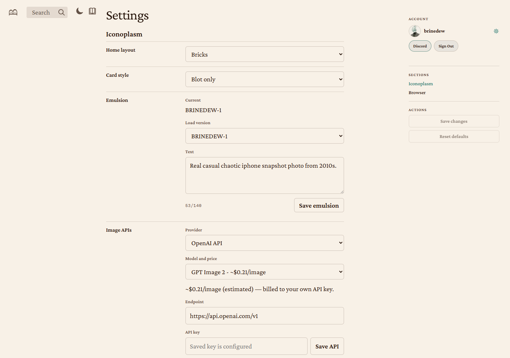

# Tutorial: How to generate and edit blots in Iconoplasm

This tutorial walks through the steps to request a new character portrait ("blot") for a gene on Iconoplasm.

It's written for people unfamiliar with how image generation services work. It will take around 10 minutes of your time.

Prerequisites: 
 * An email account
 * Bank card with $5 on it
## 1. Log in to brinedew.bio site with your Discord account

1. Go to [iconoplasm.brinedew.bio](https://iconoplasm.brinedew.bio).
2. In the right sidebar, click **Discord Login**.
3. On the Discord authorize page, click **Authorize**.
You are now redirected back as an authenticated user (your Discord nickname appears in the sidebar).
## 2. Get an API key from a provider
Iconoplasm redirects generation requests to a third party image generation service (API provider). Registering with the provider is free: the provider will only charge you around 1 to 10 cents per image when you actually start sending image generation requests. 

In this section, we will walk through the steps needed to register with a provider and obtain a key you will need for image generation.
You only need to register with **one** of supported providers: 
* Gemini API
* Krea API
* Luma Uni API
* OpenAI API
Your choice of provider might depend on your preferred payment model, discount offers, or aesthetic taste. There are no wrong choices. If you're unsure, visit brinedew.bio Discord server to ask for user opinions.
Below are the registration instructions for each provider.
### 2a. Gemini API

**Getting the key:**

1. Go to [aistudio.google.com/apikey](https://aistudio.google.com/apikey).
2. Sign in with your Google account.
3. Accept the terms of service if prompted.
4. Click **Create API key** in the top right menu.

![[image-35.png|Google AI Studio API Keys page — click "Create API key"]]

5. In the **Create a new key** dialog, give your key a name (e.g. "Iconoplasm") and pick a project.

![[image-36.png|Create a new key dialog]]

6. Click **Create key**.
7. The key appears in your API Keys table. Copy it immediately.

**Adding funds.**

Gemini API previously offered a Free tier for image generation, but the free tier has been **discontinued** for the `gemini-3.1-flash-image` model — you must set up billing to use it:
1. In the AI Studio sidebar, click **Billing**.
2. Click **Set up billing** — this links your Google Cloud billing account.

![[image-41.png|Gemini billing — set up billing to use image generation models]]

### 2b. Krea API

**Getting the key:**

1. Go to [krea.ai](https://www.krea.ai).
2. Click **Log in** at the top right.
3. Enter your email address and click **Continue with Email**.
4. A **Password** field appears. Enter your Krea password and click **Log in**.
5. After logging in, go to the [API Tokens](https://www.krea.ai/app/api/tokens) page.

![[image-31.png|Krea API Tokens page]]

6. On the API Tokens page, click **Create API Token**.
7. In the **Create a New Key** dialog that appears, give your key a name (e.g. "Iconoplasm") in the text field.

![[image-32.png|Create a new token dialog]]

8. Click **Create key**.
9. A **Key Created Successfully** dialog shows the key once. Click **Copy to clipboard** or **Copy & Close** — you can't see it again.

![[image-33.png|Key created — copy it immediately]]

**Adding funds:**

1. Go to the Krea API [Home](https://www.krea.ai/app/api) page.
   ![[image-40.png|Krea API page: Agents section is visible below]]
2. Scroll down to the **Agents** section
3. Select a top-up amount: $10.00 (or click the **Custom** button and put $5.00).
4. Click **Add** button below — this opens a Stripe Checkout. Balance applies immediately on success.

When your balance runs out, new requests will get an error message.

### 2c. Luma Uni API

**Getting the key:**

1. Go to [platform.lumalabs.ai](https://platform.lumalabs.ai).
2. Click **Sign in** at the top right (or **Sign up** if you don't have an account).
3. Sign in with your email address. If you don't have an account, enter your email and click **Continue**, then set a password.
4. Once logged in, you'll see the Luma API Console dashboard.

![[luma-api-console.png|Luma API Console dashboard — shows your balance, API keys count, and rate limits]]

5. In the left sidebar, click **API Keys**.

![[luma-api-keys.png|API Keys page — shows your existing keys and a Create Key button]]

6. On the API Keys page, click **Create Key**.
7. In the **Create API Key** dialog, give your key a name (e.g. "Iconoplasm") in the text field.

![[luma-create-key-dialog.png|Create API Key dialog — enter a name and click Create Key]]

8. Click **Create Key**. The key appears in your API Keys table. Copy it immediately — you won't be able to see it again.

**Adding funds:**

You must add a card and top up your balance before making requests to Luma API.

1. In the left sidebar, click **Billing**.

![[luma-billing.png|Billing page — shows your balance and Add Card / Add Funds buttons]]

2. Click **Add Card** to save a payment method.
3. Click **Add Funds** to top up your balance. Enter the amount you want to add and complete the payment.
4. Your balance updates immediately on success. Each image generation deducts from this balance — estimated costs are shown in the Pricing table below.

### 2d. OpenAI API

**Getting the key:**

1. Go to [platform.openai.com](https://platform.openai.com) and click **Sign up** or **Log in**.
2. Enter your email address and click **Continue**. OpenAI sends a 6-digit verification code to your inbox.
3. Check your email, enter the code, and click **Continue**.
4. Once logged in, go to [API Keys](https://platform.openai.com/api-keys).

![[image-29.png|OpenAI API Keys menu]]

5. Click **Create new secret key** button at the top right.

![[image-30.png|Key creation box]]

6. In the dialog:
   - **Name**: Give your key a label (e.g. "Iconoplasm generation")
   - **Permissions**: Keep **All** selected
   - **Project**: Keep **Default project**
7. Click **Create secret key**.

![[16-openai-key-revealed.png|The key is shown once and must be copied immediately.]]
8. A **Save your key** dialog appears showing the key once. Copy it now — you can't see it again.
**Adding funds:**

GPT Image 2 has no free tier. Without billing, Iconoplasm shows: **"Billing hard limit has been reached."** You need a credit card on file. OpenAI bills you monthly for what you use.

9. Go to [Billing overview](https://platform.openai.com/settings/organization/billing/overview).
10. Click **Add payment details**.
11. A Stripe credit card form opens. Enter your **card number**, **expiration date** (MM/YY), and **CVC code**.

12. Click **Continue**. Your card is saved. You're billed monthly for actual usage.

### 2e. fal.ai API
1. Visit https://fal.ai/login and log in using one of the suggested gateways
![[image-44.png|fal.ai login page]]

2. Complete their annoying entry survey (click whatever)

![[image-45.png|fal.ai new account survey]]
3. You will see the fal dashboard
![[image-46.png|fal dashboard main page|697]]

4. Go to https://fal.ai/dashboard/keys. You will see the keys page.
![[image-47.png|fal dashboard keys page]]
5. Tap the "+ Add key" button on top right. The dialog window will open.
![[image-48.png|574]]
6.  Tap "create key" in bottom right. The key will appear: copy it right away, you will not see it again.
7. Tap "done" after you've copied the key.

**Adding funds.**
1. Go to https://fal.ai/dashboard/usage-billing/credits
![[image-50.png|fal.ai credits page]]
2. Find the "Buy credits" card.
![[image-49.png]]
3. Tap "Custom" and input the desired amount. The minimum is $10.
4. Tap the "Buy $10.00 credits" button.
5. Fill in your address details - can leave tax ID field unfilled.
![[image-51.png]]
6. Stripe payment processing page will open, fill in your bank card details there. 
## 3. Configure your API key in Iconoplasm

Now that you have a key from one of the providers above, save it in Iconoplasm settings. The steps are the same regardless of which provider you chose.

1. Go to Brinedew.bio [user settings](brinedew.bio/settings/index) by clicking the gear icon in the right sidebar.
2. Under **Image APIs**, set **Provider** to your chosen provider (OpenAI API, Krea API, Gemini API, or Luma Uni API).
3. Paste the key you copied from your provider into the **API key** field.
4. Select a **Model** using the dropdown menu. There's no wrong choice, experiment and see which model matches your taste. High quality models are usually more expensive.
5. Click **Save API**.

## 4. Configure your emulsion

The emulsion is a short text prompt (max 140 characters) that sets the visual style and atmosphere for every blot you generate.

1. On the same Settings page, under **Iconoplasm** → **Emulsion**, find the **Text** field.
2. Enter a description of the rendering style you want for the new images you request — for example: *"Real casual chaotic iphone snapshot photo from 2010s."*
3. Click **Save emulsion**.

Your saved emulsion appears in the **Load version** dropdown. You can maintain multiple drafts.
## 5. Navigate to a gene page

1. Go to [iconoplasm.brinedew.bio](https://iconoplasm.brinedew.bio).
2. Search for a gene by symbol or name, or browse the archive.
3. Click a gene card, or go directly to `/gene/SYMBOL` (e.g. [iconoplasm.brinedew.bio/gene/INS](https://iconoplasm.brinedew.bio/gene/INS)).

## 6. Generate a new candidate blot

1. Under the canonical blot, click **New candidate** button in the bottom right.
   ![[image-37.png|Canonical blot with a new button candidate in the bottom right.]]
2. You will see a menu for requesting a **new candidate**:
   ![[image-38.png|New candidate menu]] 
3. The **Provider** selector should show your newly added provider (e.g. **OpenAI API · gpt-image-2**).
4. Keep the "emulsion" field empty, or click it to select the emulsion you saved in the user settings.
5. Keep "Prose" to send the gene sample to the model as a prose prompt. If your image model works best with a tag cloud prompt, switch the selector to "Tags".
6. Click **Generate candidate** button.
7. Wait 1-2 minutes for the new image to appear in the same dialog box.
8. Click **Publish candidate** to add the new image to the gene's candidate list.

If your provider requires billing that hasn't been set up yet, the dialog will show: **"Billing hard limit has been reached."**

## 7. Edit an existing candidate blot

1. Click the **Edit blot** pencil icon under the canonical blot or under any candidate blot.
2. The edit dialog will open, showing what characteristics you can request to edit.
   ![[image-39.png|Edit blot menu. Edit button is in the lower left corner.]]
3. Set checkmarks in the fields you want to edit. E.g. if the character looks bright green, but the "Surface tone" is dark, tap the "Surface tone" checkmark. You can set multiple checkmarks at once.
4. Click **Edit** to request an edited blot.
5. Wait 1-2 minutes for the new image to appear in the same dialog box. Drag the before/after slider to judge the results.
6. Click **Publish** to add the new image to the gene's candidate list.

## 8. Vote on candidates

- Click the checkmark (**Approve blot**) to upvote a candidate.
- Click the X (**Reject blot**) to downvote it.
- The canonical blot is the one with the highest approval score.

## Model comparison

![[NB2.png|Image edited with the Nano-Banana 2 model for age and color]]

## Pricing

Each provider sets its own rates. Iconoplasm's dropdown shows rough estimates — always check the official pricing page before generating at scale.

| Iconoplasm provider | Models in dropdown | Per-image estimate (dropdown) | Official pricing page |
|---|---|---|---|
| **Krea API** | Flux, Seedream 4, Krea 2 Large, GPT Image 2, Nano Banana Pro | ~\$0.002 – \$0.16 | [krea.ai/features/api](https://www.krea.ai/features/api) |
| **Gemini API** | 3.1 Flash Image, 3 Pro Image | ~\$0.067 – \$0.134 | [ai.google.dev/gemini-api/docs/pricing](https://ai.google.dev/gemini-api/docs/pricing) |
| **Luma Uni API** | Uni 1.1, Uni 1.1 Max | \$0.043 – \$0.103 | [lumalabs.ai/pricing](https://lumalabs.ai/pricing) |
| **OpenAI API** | GPT Image 2 | ~$0.21 | [openai.com/api/pricing](https://openai.com/api/pricing) |

All costs are billed directly by the provider, not by Iconoplasm.
