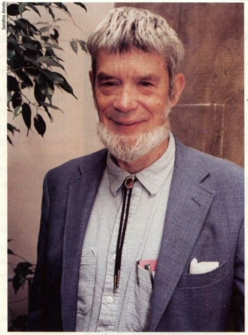

# Antagonistic Pleiotropy Theory

Antagonistic pleiotropy theory of aging explains aging as a result of evolution favoring the selection of genes that improve the organism's fitness in early life, but reduce fitness later in life. It was proposed by George Williams in 1957.

## Historical context
As of 1957, one evolutionary explanation of aging is Peter Medawar's mutation accumulation theory of aging (which introduced the concept of [selection shadow](selection-shadow-theory.md)), published in 1952. Medawar's theory models aging as a result of passive accumulation of late-acting mutations.

However, Medawar's theory only models the appearance of "aging genes" as a result of, essentially, random drift. The open question is, could "aging genes" be favored by selection pressure?

In 1957, George Williams proposes a mechanism for selection of late-life harmful traits in his paper [Pleiotropy, Natural Selection, and the Evolution of Senescence](https://doi.org/10.2307/2406060)

## The basic trade-off

*Pleiotropy* is a term from genetics, which describes a situation where one gene affects multiple traits. One example of a pleiotropic gene is ABCC11 in humans. A single 

means one gene affects multiple traits. Antagonistic pleiotropy occurs when a gene has opposite effects on fitness at different life stages - beneficial when young, harmful when old.

Since natural selection weighs early effects more heavily than late effects, genes with this pattern can be strongly favored despite causing aging. The early benefits outweigh the late costs in evolutionary terms.

## Examples

**p53**: Prevents cancer early in life by stopping damaged cells from dividing, but the same mechanism causes tissue dysfunction and aging later through cellular senescence.

**Testosterone**: Enhances male reproductive success early through muscle development and competitive behavior, but increases cardiovascular disease and cancer risk with age.

**Calcium regulation**: Strong bones during reproductive years, but the same mechanisms can lead to arterial calcification later.

## Hamilton's indicators

In his 1966 paper, WD Hamilton formalized AP with indicators of the force of selection.

## Evidence and research

Initially, Williams had limited evidence for the theory. Modern genetics has provided substantial support:

- Genome-wide studies consistently find genes with opposing early/late effects
- Many disease-associated genetic variants show signatures of past positive selection
- Experimental evolution studies demonstrate the predicted trade-offs

## Molecular mechanisms

The theory explains many puzzling aspects of aging:

- Why beneficial processes like DNA repair and immune function decline with age
- Why so many aging mechanisms appear actively harmful rather than merely broken
- Why aging phenotypes are often conserved across species

## Clinical implications

Understanding antagonistic pleiotropy helps predict which anti-aging interventions might work and which could backfire. Therapies targeting early-beneficial mechanisms need careful consideration of late-life effects.

## Relationship to cancer

Cancer represents a particularly clear case where tumor suppressor mechanisms protect young organisms but contribute to aging through cellular senescence and tissue dysfunction.

---

*Antagonistic pleiotropy shows that aging isn't just accumulated damage - it's the price paid for traits that made our ancestors reproductively successful.*
---
