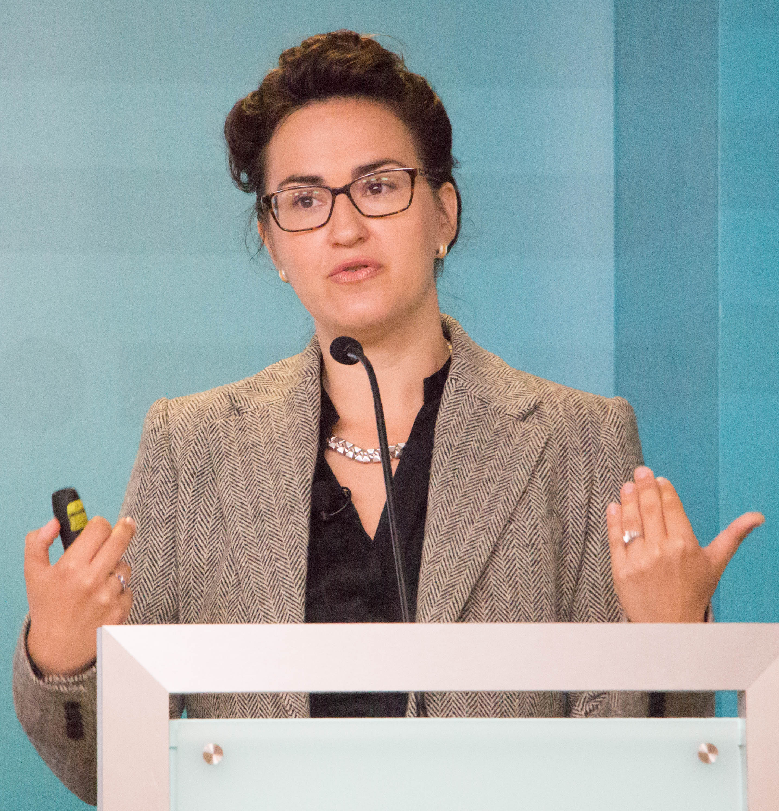

# Athena Aktipis

Athena Aktipis is an American evolutionary psychologist and cooperation researcher, professor of psychology at Arizona State University, known for framing cancer as a problem of cellular cheating within [multicellular cooperation](multicellular-cooperation.md) and for her work on human generosity.

## Cancer as cheating

Aktipis's central framing treats multicellular life as a cooperative system built on a set of enforceable agreements among cells: restraint of proliferation, respect for the control of cell death, regulated resource use, performance of specialized work, and maintenance of the shared environment. Cancer, in this view, is what happens when cells break these agreements — cheat — and selection among cell lineages amplifies the cheating. Her book *The Cheating Cell: How Evolution Helps Us Understand and Treat Cancer* (2020) developed this framework for a general audience and drew out its implications for prevention and treatment, including the idea of managing tumors as ecological systems of cooperators and defectors.

## Human cooperation

Aktipis also studies cooperation in humans. She directs the Human Generosity Project, a large interdisciplinary project combining fieldwork on food-sharing and mutual-aid systems (including Maasai pastoralist osotua networks) with computational modeling of need-based transfer.

## Notes

- Draft stub — maintenance agent to expand with the AGORA (agent-based model of cancer) project and the International Society for Evolution, Ecology and Cancer.
