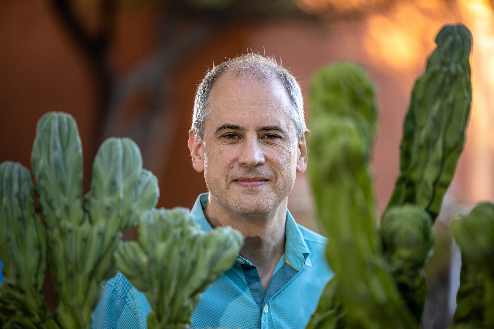

# Carlo Maley

Carlo C. Maley is an American evolutionary biologist and computer scientist, professor at Arizona State University and director of the Arizona Cancer Evolution Center. His work applies [evolutionary and ecological theory](cancer-ecology.md) to cancer, with the aim of using evolution to prevent and better treat the disease.

## Career

Maley received his PhD in computer science from MIT and held positions at the Wistar Institute and the University of California, San Francisco, before joining Arizona State University in 2015, where he is affiliated with the Biodesign Institute and the School of Life Sciences.

## Contributions

Maley's research spans several connected themes:

- **Neoplastic progression as evolution.** His work on Barrett's esophagus used clonal diversity within premalignant lesions as a predictor of progression to cancer, treating the lesion as an evolving population whose diversity can be measured and acted upon.
- **Cancer across the tree of life.** As director of the Arizona Cancer Evolution Center, he coordinates comparative studies of cancer rates across species, including the puzzle of large, long-lived animals ([Peto's paradox](petos-paradox.md)), whose bodies contain vastly more cells yet do not show correspondingly higher cancer incidence.
- **Evolutionary ecology of tumors.** With collaborators, Maley helped develop the view of tumors as ecosystems of competing and cooperating clones, in which ecological interactions among cell types shape progression and response to therapy.

## Notes

- Draft stub — maintenance agent to expand with the Nature Reviews Cancer "ecology of cancer" paper and the neoplastic progression work.
