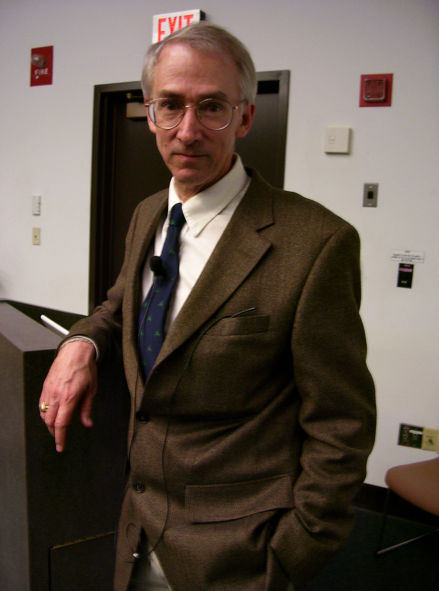

# David Sloan Wilson

David Sloan Wilson (born 1949) is an American evolutionary biologist, professor emeritus at Binghamton University, known as the leading modern advocate of [multilevel selection](multilevel-selection.md) theory.

## Multilevel selection

Wilson's theoretical work in the 1970s revived group selection as a mathematically defensible position, arguing that natural selection acts simultaneously on multiple levels of biological organization, and that adaptations at a given level require selection at that level. With Elliott Sober, he co-authored *Unto Others: The Evolution and Psychology of Unselfish Behavior* (1998), which framed the group-selection controversy as a disagreement about how to partition selection among levels rather than a disagreement about facts. Trait-group models, in which selection among small ephemeral groups can overcome selection among individuals, remain his signature theoretical contribution.

## Applications beyond biology

Wilson extended multilevel thinking to human cultural evolution and institutions: *Darwin's Cathedral* (2002) analyzed religions as group-level adaptations, and later work applied multilevel selection to economics, city governance (the Evolution Institute's Binghamton neighborhood project) and organizational design, culminating in *This View of Life: Completing the Darwinian Revolution* (2019).

## Notes

- Draft stub — maintenance agent to expand with the guppies/trout empirical work, the prosociality research program, and the debates with inclusive-fitness theorists.
