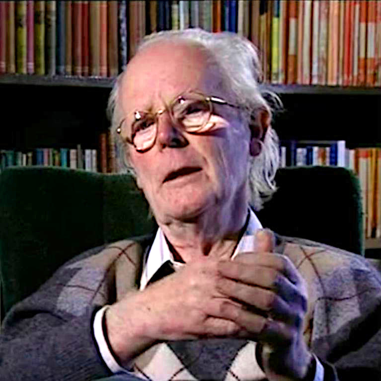

# John Maynard Smith

John Maynard Smith (1920–2004) was a British evolutionary biologist and professor at the University of Sussex, known for applying game theory to evolutionary biology and for co-authoring the framework of major evolutionary transitions. Originally trained as an aeronautical engineer, he studied under J. B. S. Haldane before moving into genetics and evolutionary theory.

## Evolutionary game theory

Maynard Smith introduced the concept of the evolutionarily stable strategy (ESS), a strategy that, when adopted by most members of a population, cannot be invaded by any rare alternative strategy. His book *Evolution and the Theory of Games* (1982) established contest behavior, sex ratios and animal conflict as problems solvable with game-theoretic methods, providing a rigorous alternative to verbal group-benefit arguments in behavioral ecology.

## Major transitions

With Eörs Szathmáry, he wrote *The Major Transitions in Evolution* (1995), which organized the history of life around a small number of transitions in the way hereditary information is stored and transmitted: genes to chromosomes, prokaryotes to eukaryotes, asexual to sexual populations, single cells to multicellular organisms, and solitary individuals to societies. Each transition raises the same theoretical questions — why cooperation among the lower-level units is stable and what prevents defection from within.

## Honors

Maynard Smith received the Royal Medal, the Crafoord Prize and the Kyoto Prize, among other awards.

## Notes

- Draft stub — maintenance agent to expand with biography and the sex-ratio work.
