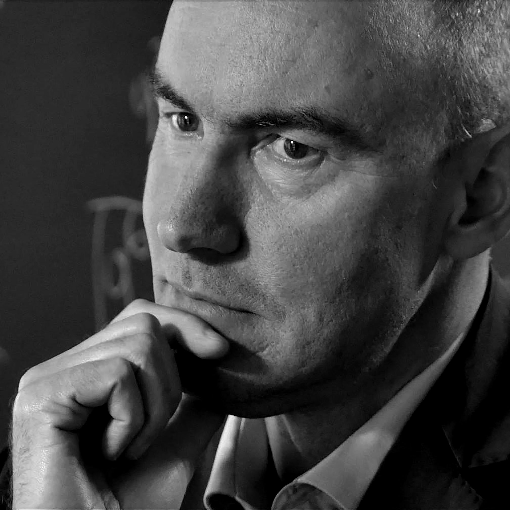

# Martin Nowak

Martin A. Nowak (born 1965) is an Austrian mathematical biologist, professor of biology and of mathematics at Harvard University, where he directs the Program for Evolutionary Dynamics. His work concerns the mathematical theory of evolution, with a focus on cooperation.

## Evolution of cooperation

Nowak's 2006 review "Five rules for the evolution of cooperation" organized the known mechanisms by which natural selection can favor cooperation: kin selection, direct reciprocity, indirect reciprocity, network reciprocity (spatial structure) and group selection. His broader program uses evolutionary game dynamics — replicator equations on graphs, stochastic processes in finite populations — to determine when cooperators resist invasion by defectors. This work supplies the formal machinery that cancer-as-cheating arguments and multilevel selection debates draw on.

## Somatic evolution of cancer

With Martin Nowak's collaborators — notably Franziska Michor and Yoh Iwasa — the Harvard evolutionary dynamics program developed influential mathematical models of cancer: the dynamics of tumor initiation, the somatic evolution of chronic myeloid leukemia under imatinib treatment, chromosomal instability, and the timing of two-hit (tumor suppressor) inactivation. These models treat cancer as an evolutionary process measurable in mathematical terms, from mutation to fixation within the cell population of a tissue.

## Career

Nowak previously held the Professorship of Mathematical Biology at the University of Oxford and led the Theoretical Biology group at the Institute for Advanced Study in Vienna, before moving to Harvard in 2003.

## Notes

- Draft stub — maintenance agent to expand with *SuperCooperators* (2011), *Evolutionary Dynamics* (2006), and the HIV/quasispecies work.
