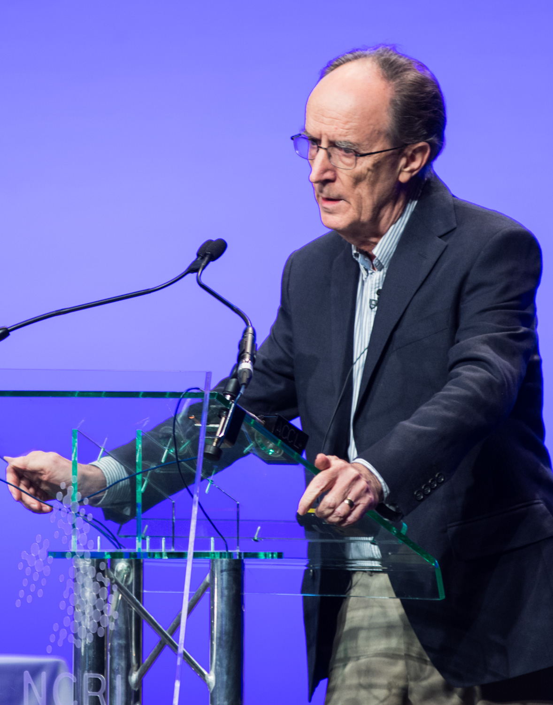

# Mel Greaves

Melvyn Greaves (born 1941) is a British cancer biologist and professor at the Institute of Cancer Research, London, known for applying [evolutionary and ecological theory](cancer-ecology.md) to cancer, and in particular to childhood leukemia.

## Cancer as an evolutionary process

Greaves's central position is that cancer is a Darwinian process: somatic evolution within the body generates clonal diversity, and selection in the tumor microenvironment — including selection imposed by therapy — drives progression, relapse and resistance. His book *Cancer: The Evolutionary Legacy* (2000) made this framework accessible to a broad audience and argued that many features of cancer, including its age distribution and its mismatch with modern environments, are legacies of evolutionary history.

## Childhood leukemia

Greaves is best known for work on acute lymphoblastic leukemia (ALL), the most common childhood cancer. He proposed that ALL typically follows a two-step process: a prenatal genetic lesion (often ETV6-RUNX1 fusion, arising in utero) followed, in a minority of children, by a second trigger in early childhood. His "delayed infection" hypothesis attributes the second step to abnormal immune responses to common infections in children with insufficient early microbial exposure, linking leukemia incidence to the hygiene-related conditions of modern societies. Epidemiological and biological evidence accumulated over subsequent decades has substantially supported this model.

## Honors

Greaves was elected a Fellow of the Royal Society in 2018.

## Notes

- Draft stub — maintenance agent to expand with biography and the back-to-ALL relapse work.
