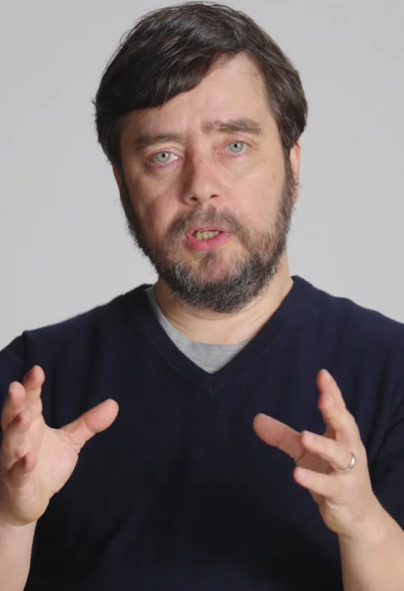

# Michael Levin

Michael Levin is an American developmental and synthetic biologist, distinguished professor at Tufts University, where he directs the Allen Discovery Center and the Tufts Center for Regenerative and Developmental Biology. His work concerns [bioelectric signaling](bioelectricity.md) and the control of large-scale anatomical form in living systems.

## Bioelectricity and pattern regulation

Levin's laboratory studies how ion fluxes and voltage gradients across cell membranes encode pattern information during development and regeneration, and how decoding or re-specifying this bioelectric information can trigger the regrowth of complex structures — including eyes, limbs and, in planarian flatworms, whole-body patterns that persist after intervention at the genomic, cellular or anatomical scale.

## Multiscale agency and collective intelligence

Levin's theoretical program treats organisms as collective intelligences: multi-scale societies of cells, each with its own competencies and goals, coordinated by physiological and electrical communication into a larger agent with goals of its own. Concepts from this program include the "cognitive light cone" — the spatial and temporal scope of goals that an agent can pursue — and the view of cancer as a collapse of cellular goals from the scale of the organism back down to the scale of the individual cell, rather than a mere accumulation of damage. This framing connects developmental biology to questions about the scaling of agency and identity that arise in [evolutionary transitions](evolutionary-transitions-in-individuality.md).

The lab's work on synthetic living constructs, including the Xenobots built from frog embryonic cells (2020), grew out of this program.

## Notes

- Draft stub — maintenance agent to expand with the cognitive glue framework, morphopsychosis debates, and the planarian memory work.
