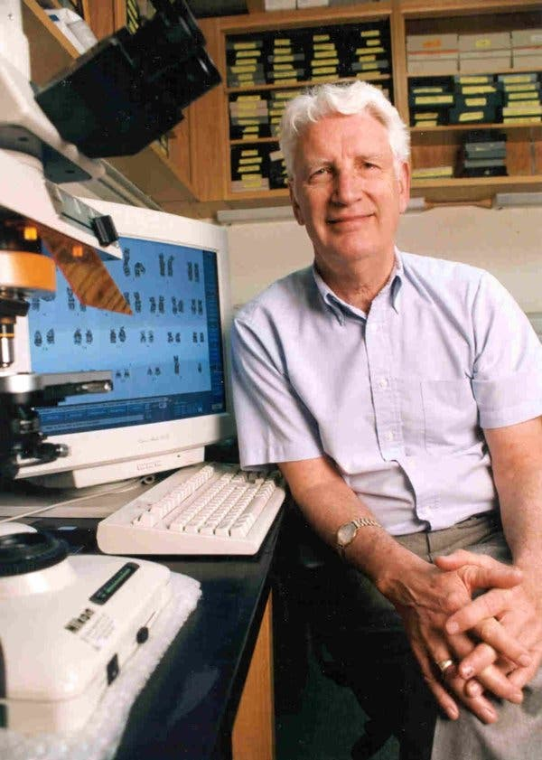

# Peter Nowell

Peter C. Nowell (1928–2016) was an American pathologist and cancer researcher at the University of Pennsylvania, known for co-discovering the Philadelphia chromosome and for the clonal evolution model of cancer.

## The Philadelphia chromosome

In 1960, Nowell and David Hungerford described an abnormally small chromosome consistently present in the leukemic cells of patients with chronic myeloid leukemia - the first genetic defect linked to a human cancer. The finding, later shown by Janet Rowley to result from a reciprocal translocation between chromosomes 9 and 22, established that cancer is a genetic disease at the level of the somatic cell and ultimately led to the targeted drug imatinib. Nowell shared the 1998 Albert Lasker Clinical Medical Research Award for this work.

## Clonal evolution of cancer

In 1976, Nowell published "The clonal evolution of tumor cell populations" in *Science*, arguing that tumors are populations of cells descended from a common ancestor, within which continuous heritable variation and selection drive progression. Genomic instability supplies the variation; the tumor microenvironment and therapy supply the selection. The paper framed cancer progression as a Darwinian evolutionary process, became the founding citation for [evolutionary oncology](cancer-ecology.md), and underlies later treatment strategies that account for selection, such as [adaptive therapy](adaptive-therapy.md).

## Notes

- Draft stub - maintenance agent to expand with biography, chairmanship of Penn Pathology, and honors.
