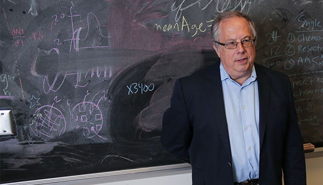

# Robert Gatenby

Robert A. Gatenby is an American physician-scientist, radiologist and professor at the Moffitt Cancer Center in Tampa, Florida, known for founding [adaptive therapy](adaptive-therapy.md) and for treating cancer as a problem in the [ecology](cancer-ecology.md) and evolution of an evolving cell population.

## Cancer as an ecological system

Gatenby's research models tumors as ecosystems: populations of competing phenotypes coupled by resource competition, waste accumulation, and interactions with stromal and immune cells. His group used game-theoretic and dynamical systems models to show that the outcome of therapy is an ecological consequence of treatment: maximum-tolerance dosing imposes the strongest possible selection for resistant phenotypes, and the extinction of sensitive competitors can even release resistant clones from competition, accelerating their expansion.

## Adaptive therapy

Adaptive therapy, first tested clinically in metastatic castration-resistant prostate cancer (published in *Science Translational Medicine* in 2009), applies this logic directly. Instead of trying to eradicate the tumor, the physician deliberately maintains a population of drug-sensitive cells, whose competitive suppression of resistant clones keeps the tumor in check. Dosing is adjusted to the measured tumor burden rather than escalated to toxicity, with the explicit goal of managing — not eliminating — the evolving population. Clinical trials have extended the approach to other cancers, and it remains the most developed clinical application of evolutionary oncology.

At Moffitt, Gatenby founded the Integrated Mathematical Oncology program, pairing mathematicians and experimentalists, and co-directs the Center of Excellence for Evolutionary Therapy.

## Notes

- Draft stub — maintenance agent to expand with the glucose/oxygen competition work and the Warburg-effect ecology papers.
