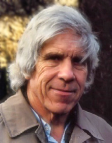

# W. D. Hamilton

William Donald Hamilton (1936–2000) was a British evolutionary biologist, known for developing the theory of inclusive fitness (kin selection) and for formalizing the evolutionary theory of aging. He held positions at Imperial College London and later at the University of Oxford.

## Inclusive fitness

In his 1964 papers "The Genetical Evolution of Social Behaviour", Hamilton showed that a gene promoting a social behavior can spread if the benefit to recipients, weighted by their genetic relatedness to the actor, exceeds the cost to the actor. This inequality — Hamilton's rule — is the mathematical formulation of kin selection and the standard starting point for explaining altruism, eusociality and the evolution of cooperation.

## The force of selection and aging

In 1966, Hamilton formalized the insight of Medawar and [George Williams](george-c-williams.md) into a precise model of the [force of selection](selection-shadow-theory.md), showing that it declines with age even in organisms with indeterminate growth, and that this decline follows from the timing of reproduction and mortality. His indicator functions for the force of selection remain the standard formalization of why late-acting harmful mutations are weakly opposed by selection, and underpin both the [selection shadow](selection-shadow-theory.md) and [antagonistic pleiotropy](antagonistic-pleiotropy-theory.md) theories of aging.

## Other work

Hamilton also proposed the [Red Queen hypothesis](red-queen-hypothesis.md) for the maintenance of sex, made foundational contributions to parasite–host coevolution, and worked on the evolution of senescence, cooperation and spite. He received the Crafoord Prize and the Kyoto Prize, and died in 2000 from complications of malaria contracted during a field trip to the Congo.

## Notes

- Draft stub — maintenance agent to expand with biography (*Narrow Roads of Gene Land*) and the 1967 extraordinary sex ratios work.
