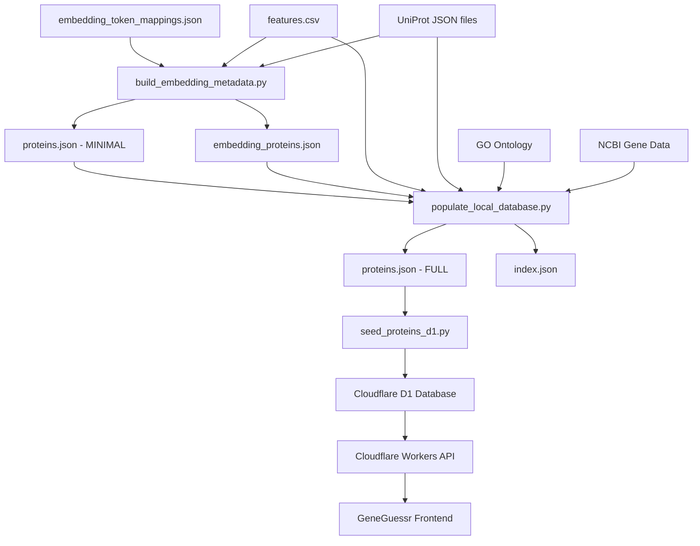

# GeneGuessr Data Pipeline Architecture

## Current Pipeline Overview



## File Responsibilities

### `build_embedding_metadata.py` (220 lines)
**Purpose**: Quick, minimal protein record generation
- **Input**: 
  - `embedding_token_mappings.json` (token → UniProt mappings)
  - `features.csv` (basic protein features)
  - UniProt JSON files
- **Output**:
  - `proteins.json` (minimal: uniprot, hgnc, full_name, length, synonyms)
  - `embedding_proteins.json` (snapshot copy)
- **Speed**: Fast (~220 lines, minimal processing)
- **Use Case**: Quick regeneration of basic protein list

---

### `populate_local_database.py` (1300 lines)
**Purpose**: Comprehensive protein enrichment with full metadata
- **Input**:
  - `embedding_proteins.json` (from build_embedding_metadata.py)
  - `features.csv`
  - UniProt JSON files
  - GO Ontology (go-basic.obo)
  - NCBI Gene data (via datasets CLI)
  - HGNC API (for aliases)
- **Output**:
  - `proteins.json` (FULL: all fields including GO terms, domains, structure, summaries)
  - `index.json` (eligible protein IDs + seed salt)
- **Speed**: Slow (1300 lines, extensive API calls, GO processing)
- **Use Case**: Full database rebuild with all enrichments

---

## Key Differences

| Feature | build_embedding_metadata.py | populate_local_database.py |
|---------|----------------------------|----------------------------|
| **Lines of Code** | 220 | 1300 |
| **Speed** | Fast | Slow |
| **Data Sources** | 3 (mappings, features, UniProt) | 6+ (includes GO, NCBI, HGNC APIs) |
| **Output Fields** | 5 basic fields | 20+ enriched fields |
| **GO Terms** | ❌ No | ✅ Yes |
| **Domains** | ❌ No | ✅ Yes (InterPro) |
| **Structure Info** | ❌ No | ✅ Yes (PDB, AlphaFold) |
| **Gene Summaries** | ❌ No | ✅ Yes (NCBI/MyGene/UniProt) |
| **Reactome Pathways** | ❌ No | ✅ Yes |
| **Tissue Specificity** | ❌ No | ✅ Yes |
| **API Calls** | None | Many (NCBI, HGNC, MyGene) |

---

## Pipeline Flow

### Quick Update (Minimal Changes)
```bash
python scripts/build_embedding_metadata.py
# → Updates proteins.json with basic fields only
# → Fast, no API calls
```

### Full Rebuild (Complete Enrichment)
```bash
python scripts/populate_local_database.py
# → Reads embedding_proteins.json from build_embedding_metadata.py
# → Enriches with GO, domains, structures, summaries
# → Writes comprehensive proteins.json
# → Slow, makes API calls
```

### Deploy to Production
```bash
python scripts/seed_proteins_d1.py
# → Reads proteins.json
# → Seeds Cloudflare D1 database
# → Used by Workers API
```

---

## Recommendation: Keep Both Files Separate

**Reasons**:
1. **Different Use Cases**: 
   - `build_embedding_metadata.py` = Quick updates to basic protein list
   - `populate_local_database.py` = Full enrichment with all metadata

2. **Performance**:
   - Quick script runs in seconds
   - Full script takes minutes (API calls, GO processing)

3. **Development Workflow**:
   - Test basic protein additions quickly
   - Run full enrichment only when needed

4. **Modularity**:
   - Clear separation of concerns
   - Easier to maintain and debug

---

## For B-144 (Popularity Metrics)

**Add popularity to**: `populate_local_database.py`
- This is where all enrichment happens
- Already has UniProt data access
- Can extract annotation score from UniProt JSON
- Will be included in final `proteins.json`

**Don't modify**: `build_embedding_metadata.py`
- Keep it minimal and fast
- Popularity is an enrichment, not a basic field
